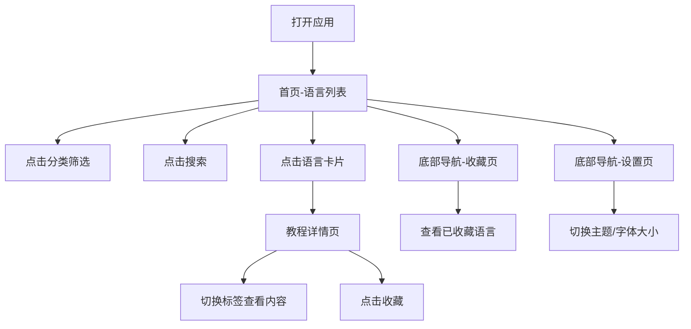

# 产品需求文档 (PR# 产品需求文档 (PRD) - CodeMastery 编程语言教程# 产品需求文档 (PRD) - CodeMastery 编程语言教程应用

## 1. 产品概述# 产品需求文档 (PRD) - CodeMastery 编程语言教程应用

## 1. 产品概述

CodeMastery 是一款面向编程初学者# 产品需求文档 (PRD) - CodeMastery 编程语言教程应用

## 1. 产品概述

CodeMastery 是一款面向编程初学者和进阶开发者的教程展示应用，聚合了# 产品需求文档 (PRD) - CodeMastery 编程语言教程应用

## 1. 产品概述

CodeMastery 是一款面向编程初学者和进阶开发者的教程展示应用，聚合了 Python、JavaScript、Java、Go、Rust、TypeScript 等热门编程语言的核心教程# 产品需求文档 (PRD) - CodeMastery 编程语言教程应用

## 1. 产品概述

CodeMastery 是一款面向编程初学者和进阶开发者的教程展示应用，聚合了 Python、JavaScript、Java、Go、Rust、TypeScript 等热门编程语言的核心教程。应用采用类似 Android Material Design 3# 产品需求文档 (PRD) - CodeMastery 编程语言教程应用

## 1. 产品概述

CodeMastery 是一款面向编程初学者和进阶开发者的教程展示应用，聚合了 Python、JavaScript、Java、Go、Rust、TypeScript 等热门编程语言的核心教程。应用采用类似 Android Material Design 3 的卡片式交互设计，支持深色/浅色# 产品需求文档 (PRD) - CodeMastery 编程语言教程应用

## 1. 产品概述

CodeMastery 是一款面向编程初学者和进阶开发者的教程展示应用，聚合了 Python、JavaScript、Java、Go、Rust、TypeScript 等热门编程语言的核心教程。应用采用类似 Android Material Design 3 的卡片式交互设计，支持深色/浅色主题切换，提供沉浸式的代码学习体验。

目标用户：编程入门者、技术# 产品需求文档 (PRD) - CodeMastery 编程语言教程应用

## 1. 产品概述

CodeMastery 是一款面向编程初学者和进阶开发者的教程展示应用，聚合了 Python、JavaScript、Java、Go、Rust、TypeScript 等热门编程语言的核心教程。应用采用类似 Android Material Design 3 的卡片式交互设计，支持深色/浅色主题切换，提供沉浸式的代码学习体验。

目标用户：编程入门者、技术转型人员、希望快速复习语言特性的开发者。

## 2. 核心功能

### 2.1 用户角色
# 产品需求文档 (PRD) - CodeMastery 编程语言教程应用

## 1. 产品概述

CodeMastery 是一款面向编程初学者和进阶开发者的教程展示应用，聚合了 Python、JavaScript、Java、Go、Rust、TypeScript 等热门编程语言的核心教程。应用采用类似 Android Material Design 3 的卡片式交互设计，支持深色/浅色主题切换，提供沉浸式的代码学习体验。

目标用户：编程入门者、技术转型人员、希望快速复习语言特性的开发者。

## 2. 核心功能

### 2.1 用户角色

| 角色 | 注册方式 |# 产品需求文档 (PRD) - CodeMastery 编程语言教程应用

## 1. 产品概述

CodeMastery 是一款面向编程初学者和进阶开发者的教程展示应用，聚合了 Python、JavaScript、Java、Go、Rust、TypeScript 等热门编程语言的核心教程。应用采用类似 Android Material Design 3 的卡片式交互设计，支持深色/浅色主题切换，提供沉浸式的代码学习体验。

目标用户：编程入门者、技术转型人员、希望快速复习语言特性的开发者。

## 2. 核心功能

### 2.1 用户角色

| 角色 | 注册方式 | 核心权限 |
|------|----------|----------# 产品需求文档 (PRD) - CodeMastery 编程语言教程应用

## 1. 产品概述

CodeMastery 是一款面向编程初学者和进阶开发者的教程展示应用，聚合了 Python、JavaScript、Java、Go、Rust、TypeScript 等热门编程语言的核心教程。应用采用类似 Android Material Design 3 的卡片式交互设计，支持深色/浅色主题切换，提供沉浸式的代码学习体验。

目标用户：编程入门者、技术转型人员、希望快速复习语言特性的开发者。

## 2. 核心功能

### 2.1 用户角色

| 角色 | 注册方式 | 核心权限 |
|------|----------|----------|
| 普通用户 | 无需注册# 产品需求文档 (PRD) - CodeMastery 编程语言教程应用

## 1. 产品概述

CodeMastery 是一款面向编程初学者和进阶开发者的教程展示应用，聚合了 Python、JavaScript、Java、Go、Rust、TypeScript 等热门编程语言的核心教程。应用采用类似 Android Material Design 3 的卡片式交互设计，支持深色/浅色主题切换，提供沉浸式的代码学习体验。

目标用户：编程入门者、技术转型人员、希望快速复习语言特性的开发者。

## 2. 核心功能

### 2.1 用户角色

| 角色 | 注册方式 | 核心权限 |
|------|----------|----------|
| 普通用户 | 无需注册 | 浏览教程、查看代码示例、切换主题、收藏内容 |

### 2# 产品需求文档 (PRD) - CodeMastery 编程语言教程应用

## 1. 产品概述

CodeMastery 是一款面向编程初学者和进阶开发者的教程展示应用，聚合了 Python、JavaScript、Java、Go、Rust、TypeScript 等热门编程语言的核心教程。应用采用类似 Android Material Design 3 的卡片式交互设计，支持深色/浅色主题切换，提供沉浸式的代码学习体验。

目标用户：编程入门者、技术转型人员、希望快速复习语言特性的开发者。

## 2. 核心功能

### 2.1 用户角色

| 角色 | 注册方式 | 核心权限 |
|------|----------|----------|
| 普通用户 | 无需注册 | 浏览教程、查看代码示例、切换主题、收藏内容 |

### 2.2 功能模块

1. **# 产品需求文档 (PRD) - CodeMastery 编程语言教程应用

## 1. 产品概述

CodeMastery 是一款面向编程初学者和进阶开发者的教程展示应用，聚合了 Python、JavaScript、Java、Go、Rust、TypeScript 等热门编程语言的核心教程。应用采用类似 Android Material Design 3 的卡片式交互设计，支持深色/浅色主题切换，提供沉浸式的代码学习体验。

目标用户：编程入门者、技术转型人员、希望快速复习语言特性的开发者。

## 2. 核心功能

### 2.1 用户角色

| 角色 | 注册方式 | 核心权限 |
|------|----------|----------|
| 普通用户 | 无需注册 | 浏览教程、查看代码示例、切换主题、收藏内容 |

### 2.2 功能模块

1. **首页（语言列表）**：展示所有编程语言卡片，支持分类筛选和搜索
2.# 产品需求文档 (PRD) - CodeMastery 编程语言教程应用

## 1. 产品概述

CodeMastery 是一款面向编程初学者和进阶开发者的教程展示应用，聚合了 Python、JavaScript、Java、Go、Rust、TypeScript 等热门编程语言的核心教程。应用采用类似 Android Material Design 3 的卡片式交互设计，支持深色/浅色主题切换，提供沉浸式的代码学习体验。

目标用户：编程入门者、技术转型人员、希望快速复习语言特性的开发者。

## 2. 核心功能

### 2.1 用户角色

| 角色 | 注册方式 | 核心权限 |
|------|----------|----------|
| 普通用户 | 无需注册 | 浏览教程、查看代码示例、切换主题、收藏内容 |

### 2.2 功能模块

1. **首页（语言列表）**：展示所有编程语言卡片，支持分类筛选和搜索
2. **教程详情页**：展示语言介绍、语法# 产品需求文档 (PRD) - CodeMastery 编程语言教程应用

## 1. 产品概述

CodeMastery 是一款面向编程初学者和进阶开发者的教程展示应用，聚合了 Python、JavaScript、Java、Go、Rust、TypeScript 等热门编程语言的核心教程。应用采用类似 Android Material Design 3 的卡片式交互设计，支持深色/浅色主题切换，提供沉浸式的代码学习体验。

目标用户：编程入门者、技术转型人员、希望快速复习语言特性的开发者。

## 2. 核心功能

### 2.1 用户角色

| 角色 | 注册方式 | 核心权限 |
|------|----------|----------|
| 普通用户 | 无需注册 | 浏览教程、查看代码示例、切换主题、收藏内容 |

### 2.2 功能模块

1. **首页（语言列表）**：展示所有编程语言卡片，支持分类筛选和搜索
2. **教程详情页**：展示语言介绍、语法特性、代码示例、运行结果说明
3. **收藏页**：用户收藏的语言和教程# 产品需求文档 (PRD) - CodeMastery 编程语言教程应用

## 1. 产品概述

CodeMastery 是一款面向编程初学者和进阶开发者的教程展示应用，聚合了 Python、JavaScript、Java、Go、Rust、TypeScript 等热门编程语言的核心教程。应用采用类似 Android Material Design 3 的卡片式交互设计，支持深色/浅色主题切换，提供沉浸式的代码学习体验。

目标用户：编程入门者、技术转型人员、希望快速复习语言特性的开发者。

## 2. 核心功能

### 2.1 用户角色

| 角色 | 注册方式 | 核心权限 |
|------|----------|----------|
| 普通用户 | 无需注册 | 浏览教程、查看代码示例、切换主题、收藏内容 |

### 2.2 功能模块

1. **首页（语言列表）**：展示所有编程语言卡片，支持分类筛选和搜索
2. **教程详情页**：展示语言介绍、语法特性、代码示例、运行结果说明
3. **收藏页**：用户收藏的语言和教程快速访问
4. **设置页**：主题# 产品需求文档 (PRD) - CodeMastery 编程语言教程应用

## 1. 产品概述

CodeMastery 是一款面向编程初学者和进阶开发者的教程展示应用，聚合了 Python、JavaScript、Java、Go、Rust、TypeScript 等热门编程语言的核心教程。应用采用类似 Android Material Design 3 的卡片式交互设计，支持深色/浅色主题切换，提供沉浸式的代码学习体验。

目标用户：编程入门者、技术转型人员、希望快速复习语言特性的开发者。

## 2. 核心功能

### 2.1 用户角色

| 角色 | 注册方式 | 核心权限 |
|------|----------|----------|
| 普通用户 | 无需注册 | 浏览教程、查看代码示例、切换主题、收藏内容 |

### 2.2 功能模块

1. **首页（语言列表）**：展示所有编程语言卡片，支持分类筛选和搜索
2. **教程详情页**：展示语言介绍、语法特性、代码示例、运行结果说明
3. **收藏页**：用户收藏的语言和教程快速访问
4. **设置页**：主题切换（浅色/深色/跟随系统）、字体# 产品需求文档 (PRD) - CodeMastery 编程语言教程应用

## 1. 产品概述

CodeMastery 是一款面向编程初学者和进阶开发者的教程展示应用，聚合了 Python、JavaScript、Java、Go、Rust、TypeScript 等热门编程语言的核心教程。应用采用类似 Android Material Design 3 的卡片式交互设计，支持深色/浅色主题切换，提供沉浸式的代码学习体验。

目标用户：编程入门者、技术转型人员、希望快速复习语言特性的开发者。

## 2. 核心功能

### 2.1 用户角色

| 角色 | 注册方式 | 核心权限 |
|------|----------|----------|
| 普通用户 | 无需注册 | 浏览教程、查看代码示例、切换主题、收藏内容 |

### 2.2 功能模块

1. **首页（语言列表）**：展示所有编程语言卡片，支持分类筛选和搜索
2. **教程详情页**：展示语言介绍、语法特性、代码示例、运行结果说明
3. **收藏页**：用户收藏的语言和教程快速访问
4. **设置页**：主题切换（浅色/深色/跟随系统）、字体大小调整

### 2.3 页面详情

| 页面名称 |# 产品需求文档 (PRD) - CodeMastery 编程语言教程应用

## 1. 产品概述

CodeMastery 是一款面向编程初学者和进阶开发者的教程展示应用，聚合了 Python、JavaScript、Java、Go、Rust、TypeScript 等热门编程语言的核心教程。应用采用类似 Android Material Design 3 的卡片式交互设计，支持深色/浅色主题切换，提供沉浸式的代码学习体验。

目标用户：编程入门者、技术转型人员、希望快速复习语言特性的开发者。

## 2. 核心功能

### 2.1 用户角色

| 角色 | 注册方式 | 核心权限 |
|------|----------|----------|
| 普通用户 | 无需注册 | 浏览教程、查看代码示例、切换主题、收藏内容 |

### 2.2 功能模块

1. **首页（语言列表）**：展示所有编程语言卡片，支持分类筛选和搜索
2. **教程详情页**：展示语言介绍、语法特性、代码示例、运行结果说明
3. **收藏页**：用户收藏的语言和教程快速访问
4. **设置页**：主题切换（浅色/深色/跟随系统）、字体大小调整

### 2.3 页面详情

| 页面名称 | 模块名称 | 功能描述 |
|----------# 产品需求文档 (PRD) - CodeMastery 编程语言教程应用

## 1. 产品概述

CodeMastery 是一款面向编程初学者和进阶开发者的教程展示应用，聚合了 Python、JavaScript、Java、Go、Rust、TypeScript 等热门编程语言的核心教程。应用采用类似 Android Material Design 3 的卡片式交互设计，支持深色/浅色主题切换，提供沉浸式的代码学习体验。

目标用户：编程入门者、技术转型人员、希望快速复习语言特性的开发者。

## 2. 核心功能

### 2.1 用户角色

| 角色 | 注册方式 | 核心权限 |
|------|----------|----------|
| 普通用户 | 无需注册 | 浏览教程、查看代码示例、切换主题、收藏内容 |

### 2.2 功能模块

1. **首页（语言列表）**：展示所有编程语言卡片，支持分类筛选和搜索
2. **教程详情页**：展示语言介绍、语法特性、代码示例、运行结果说明
3. **收藏页**：用户收藏的语言和教程快速访问
4. **设置页**：主题切换（浅色/深色/跟随系统）、字体大小调整

### 2.3 页面详情

| 页面名称 | 模块名称 | 功能描述 |
|----------|----------|----------|
| 首页 |# 产品需求文档 (PRD) - CodeMastery 编程语言教程应用

## 1. 产品概述

CodeMastery 是一款面向编程初学者和进阶开发者的教程展示应用，聚合了 Python、JavaScript、Java、Go、Rust、TypeScript 等热门编程语言的核心教程。应用采用类似 Android Material Design 3 的卡片式交互设计，支持深色/浅色主题切换，提供沉浸式的代码学习体验。

目标用户：编程入门者、技术转型人员、希望快速复习语言特性的开发者。

## 2. 核心功能

### 2.1 用户角色

| 角色 | 注册方式 | 核心权限 |
|------|----------|----------|
| 普通用户 | 无需注册 | 浏览教程、查看代码示例、切换主题、收藏内容 |

### 2.2 功能模块

1. **首页（语言列表）**：展示所有编程语言卡片，支持分类筛选和搜索
2. **教程详情页**：展示语言介绍、语法特性、代码示例、运行结果说明
3. **收藏页**：用户收藏的语言和教程快速访问
4. **设置页**：主题切换（浅色/深色/跟随系统）、字体大小调整

### 2.3 页面详情

| 页面名称 | 模块名称 | 功能描述 |
|----------|----------|----------|
| 首页 | 顶部导航栏 | 应用标题 +# 产品需求文档 (PRD) - CodeMastery 编程语言教程应用

## 1. 产品概述

CodeMastery 是一款面向编程初学者和进阶开发者的教程展示应用，聚合了 Python、JavaScript、Java、Go、Rust、TypeScript 等热门编程语言的核心教程。应用采用类似 Android Material Design 3 的卡片式交互设计，支持深色/浅色主题切换，提供沉浸式的代码学习体验。

目标用户：编程入门者、技术转型人员、希望快速复习语言特性的开发者。

## 2. 核心功能

### 2.1 用户角色

| 角色 | 注册方式 | 核心权限 |
|------|----------|----------|
| 普通用户 | 无需注册 | 浏览教程、查看代码示例、切换主题、收藏内容 |

### 2.2 功能模块

1. **首页（语言列表）**：展示所有编程语言卡片，支持分类筛选和搜索
2. **教程详情页**：展示语言介绍、语法特性、代码示例、运行结果说明
3. **收藏页**：用户收藏的语言和教程快速访问
4. **设置页**：主题切换（浅色/深色/跟随系统）、字体大小调整

### 2.3 页面详情

| 页面名称 | 模块名称 | 功能描述 |
|----------|----------|----------|
| 首页 | 顶部导航栏 | 应用标题 + 搜索图标 + 主题切换图标 |
| 首页 | 分类筛选栏 | 全部# 产品需求文档 (PRD) - CodeMastery 编程语言教程应用

## 1. 产品概述

CodeMastery 是一款面向编程初学者和进阶开发者的教程展示应用，聚合了 Python、JavaScript、Java、Go、Rust、TypeScript 等热门编程语言的核心教程。应用采用类似 Android Material Design 3 的卡片式交互设计，支持深色/浅色主题切换，提供沉浸式的代码学习体验。

目标用户：编程入门者、技术转型人员、希望快速复习语言特性的开发者。

## 2. 核心功能

### 2.1 用户角色

| 角色 | 注册方式 | 核心权限 |
|------|----------|----------|
| 普通用户 | 无需注册 | 浏览教程、查看代码示例、切换主题、收藏内容 |

### 2.2 功能模块

1. **首页（语言列表）**：展示所有编程语言卡片，支持分类筛选和搜索
2. **教程详情页**：展示语言介绍、语法特性、代码示例、运行结果说明
3. **收藏页**：用户收藏的语言和教程快速访问
4. **设置页**：主题切换（浅色/深色/跟随系统）、字体大小调整

### 2.3 页面详情

| 页面名称 | 模块名称 | 功能描述 |
|----------|----------|----------|
| 首页 | 顶部导航栏 | 应用标题 + 搜索图标 + 主题切换图标 |
| 首页 | 分类筛选栏 | 全部 / 前端 / 后端 / 系统级# 产品需求文档 (PRD) - CodeMastery 编程语言教程应用

## 1. 产品概述

CodeMastery 是一款面向编程初学者和进阶开发者的教程展示应用，聚合了 Python、JavaScript、Java、Go、Rust、TypeScript 等热门编程语言的核心教程。应用采用类似 Android Material Design 3 的卡片式交互设计，支持深色/浅色主题切换，提供沉浸式的代码学习体验。

目标用户：编程入门者、技术转型人员、希望快速复习语言特性的开发者。

## 2. 核心功能

### 2.1 用户角色

| 角色 | 注册方式 | 核心权限 |
|------|----------|----------|
| 普通用户 | 无需注册 | 浏览教程、查看代码示例、切换主题、收藏内容 |

### 2.2 功能模块

1. **首页（语言列表）**：展示所有编程语言卡片，支持分类筛选和搜索
2. **教程详情页**：展示语言介绍、语法特性、代码示例、运行结果说明
3. **收藏页**：用户收藏的语言和教程快速访问
4. **设置页**：主题切换（浅色/深色/跟随系统）、字体大小调整

### 2.3 页面详情

| 页面名称 | 模块名称 | 功能描述 |
|----------|----------|----------|
| 首页 | 顶部导航栏 | 应用标题 + 搜索图标 + 主题切换图标 |
| 首页 | 分类筛选栏 | 全部 / 前端 / 后端 / 系统级 / 数据科学 横向滚动筛选 |
# 产品需求文档 (PRD) - CodeMastery 编程语言教程应用

## 1. 产品概述

CodeMastery 是一款面向编程初学者和进阶开发者的教程展示应用，聚合了 Python、JavaScript、Java、Go、Rust、TypeScript 等热门编程语言的核心教程。应用采用类似 Android Material Design 3 的卡片式交互设计，支持深色/浅色主题切换，提供沉浸式的代码学习体验。

目标用户：编程入门者、技术转型人员、希望快速复习语言特性的开发者。

## 2. 核心功能

### 2.1 用户角色

| 角色 | 注册方式 | 核心权限 |
|------|----------|----------|
| 普通用户 | 无需注册 | 浏览教程、查看代码示例、切换主题、收藏内容 |

### 2.2 功能模块

1. **首页（语言列表）**：展示所有编程语言卡片，支持分类筛选和搜索
2. **教程详情页**：展示语言介绍、语法特性、代码示例、运行结果说明
3. **收藏页**：用户收藏的语言和教程快速访问
4. **设置页**：主题切换（浅色/深色/跟随系统）、字体大小调整

### 2.3 页面详情

| 页面名称 | 模块名称 | 功能描述 |
|----------|----------|----------|
| 首页 | 顶部导航栏 | 应用标题 + 搜索图标 + 主题切换图标 |
| 首页 | 分类筛选栏 | 全部 / 前端 / 后端 / 系统级 / 数据科学 横向滚动筛选 |
| 首页 | 语言卡片网格 |# 产品需求文档 (PRD) - CodeMastery 编程语言教程应用

## 1. 产品概述

CodeMastery 是一款面向编程初学者和进阶开发者的教程展示应用，聚合了 Python、JavaScript、Java、Go、Rust、TypeScript 等热门编程语言的核心教程。应用采用类似 Android Material Design 3 的卡片式交互设计，支持深色/浅色主题切换，提供沉浸式的代码学习体验。

目标用户：编程入门者、技术转型人员、希望快速复习语言特性的开发者。

## 2. 核心功能

### 2.1 用户角色

| 角色 | 注册方式 | 核心权限 |
|------|----------|----------|
| 普通用户 | 无需注册 | 浏览教程、查看代码示例、切换主题、收藏内容 |

### 2.2 功能模块

1. **首页（语言列表）**：展示所有编程语言卡片，支持分类筛选和搜索
2. **教程详情页**：展示语言介绍、语法特性、代码示例、运行结果说明
3. **收藏页**：用户收藏的语言和教程快速访问
4. **设置页**：主题切换（浅色/深色/跟随系统）、字体大小调整

### 2.3 页面详情

| 页面名称 | 模块名称 | 功能描述 |
|----------|----------|----------|
| 首页 | 顶部导航栏 | 应用标题 + 搜索图标 + 主题切换图标 |
| 首页 | 分类筛选栏 | 全部 / 前端 / 后端 / 系统级 / 数据科学 横向滚动筛选 |
| 首页 | 语言卡片网格 | 每个卡片展示语言图标、名称、简介、难度标签、学习人数 |
| 首页# 产品需求文档 (PRD) - CodeMastery 编程语言教程应用

## 1. 产品概述

CodeMastery 是一款面向编程初学者和进阶开发者的教程展示应用，聚合了 Python、JavaScript、Java、Go、Rust、TypeScript 等热门编程语言的核心教程。应用采用类似 Android Material Design 3 的卡片式交互设计，支持深色/浅色主题切换，提供沉浸式的代码学习体验。

目标用户：编程入门者、技术转型人员、希望快速复习语言特性的开发者。

## 2. 核心功能

### 2.1 用户角色

| 角色 | 注册方式 | 核心权限 |
|------|----------|----------|
| 普通用户 | 无需注册 | 浏览教程、查看代码示例、切换主题、收藏内容 |

### 2.2 功能模块

1. **首页（语言列表）**：展示所有编程语言卡片，支持分类筛选和搜索
2. **教程详情页**：展示语言介绍、语法特性、代码示例、运行结果说明
3. **收藏页**：用户收藏的语言和教程快速访问
4. **设置页**：主题切换（浅色/深色/跟随系统）、字体大小调整

### 2.3 页面详情

| 页面名称 | 模块名称 | 功能描述 |
|----------|----------|----------|
| 首页 | 顶部导航栏 | 应用标题 + 搜索图标 + 主题切换图标 |
| 首页 | 分类筛选栏 | 全部 / 前端 / 后端 / 系统级 / 数据科学 横向滚动筛选 |
| 首页 | 语言卡片网格 | 每个卡片展示语言图标、名称、简介、难度标签、学习人数 |
| 首页 | 底部导航栏 | 首页 /# 产品需求文档 (PRD) - CodeMastery 编程语言教程应用

## 1. 产品概述

CodeMastery 是一款面向编程初学者和进阶开发者的教程展示应用，聚合了 Python、JavaScript、Java、Go、Rust、TypeScript 等热门编程语言的核心教程。应用采用类似 Android Material Design 3 的卡片式交互设计，支持深色/浅色主题切换，提供沉浸式的代码学习体验。

目标用户：编程入门者、技术转型人员、希望快速复习语言特性的开发者。

## 2. 核心功能

### 2.1 用户角色

| 角色 | 注册方式 | 核心权限 |
|------|----------|----------|
| 普通用户 | 无需注册 | 浏览教程、查看代码示例、切换主题、收藏内容 |

### 2.2 功能模块

1. **首页（语言列表）**：展示所有编程语言卡片，支持分类筛选和搜索
2. **教程详情页**：展示语言介绍、语法特性、代码示例、运行结果说明
3. **收藏页**：用户收藏的语言和教程快速访问
4. **设置页**：主题切换（浅色/深色/跟随系统）、字体大小调整

### 2.3 页面详情

| 页面名称 | 模块名称 | 功能描述 |
|----------|----------|----------|
| 首页 | 顶部导航栏 | 应用标题 + 搜索图标 + 主题切换图标 |
| 首页 | 分类筛选栏 | 全部 / 前端 / 后端 / 系统级 / 数据科学 横向滚动筛选 |
| 首页 | 语言卡片网格 | 每个卡片展示语言图标、名称、简介、难度标签、学习人数 |
| 首页 | 底部导航栏 | 首页 / 收藏 / 设置 三个主入口 |
# 产品需求文档 (PRD) - CodeMastery 编程语言教程应用

## 1. 产品概述

CodeMastery 是一款面向编程初学者和进阶开发者的教程展示应用，聚合了 Python、JavaScript、Java、Go、Rust、TypeScript 等热门编程语言的核心教程。应用采用类似 Android Material Design 3 的卡片式交互设计，支持深色/浅色主题切换，提供沉浸式的代码学习体验。

目标用户：编程入门者、技术转型人员、希望快速复习语言特性的开发者。

## 2. 核心功能

### 2.1 用户角色

| 角色 | 注册方式 | 核心权限 |
|------|----------|----------|
| 普通用户 | 无需注册 | 浏览教程、查看代码示例、切换主题、收藏内容 |

### 2.2 功能模块

1. **首页（语言列表）**：展示所有编程语言卡片，支持分类筛选和搜索
2. **教程详情页**：展示语言介绍、语法特性、代码示例、运行结果说明
3. **收藏页**：用户收藏的语言和教程快速访问
4. **设置页**：主题切换（浅色/深色/跟随系统）、字体大小调整

### 2.3 页面详情

| 页面名称 | 模块名称 | 功能描述 |
|----------|----------|----------|
| 首页 | 顶部导航栏 | 应用标题 + 搜索图标 + 主题切换图标 |
| 首页 | 分类筛选栏 | 全部 / 前端 / 后端 / 系统级 / 数据科学 横向滚动筛选 |
| 首页 | 语言卡片网格 | 每个卡片展示语言图标、名称、简介、难度标签、学习人数 |
| 首页 | 底部导航栏 | 首页 / 收藏 / 设置 三个主入口 |
| 教程详情页 | 顶部返回栏 | 返回按钮 + 语言名称 +# 产品需求文档 (PRD) - CodeMastery 编程语言教程应用

## 1. 产品概述

CodeMastery 是一款面向编程初学者和进阶开发者的教程展示应用，聚合了 Python、JavaScript、Java、Go、Rust、TypeScript 等热门编程语言的核心教程。应用采用类似 Android Material Design 3 的卡片式交互设计，支持深色/浅色主题切换，提供沉浸式的代码学习体验。

目标用户：编程入门者、技术转型人员、希望快速复习语言特性的开发者。

## 2. 核心功能

### 2.1 用户角色

| 角色 | 注册方式 | 核心权限 |
|------|----------|----------|
| 普通用户 | 无需注册 | 浏览教程、查看代码示例、切换主题、收藏内容 |

### 2.2 功能模块

1. **首页（语言列表）**：展示所有编程语言卡片，支持分类筛选和搜索
2. **教程详情页**：展示语言介绍、语法特性、代码示例、运行结果说明
3. **收藏页**：用户收藏的语言和教程快速访问
4. **设置页**：主题切换（浅色/深色/跟随系统）、字体大小调整

### 2.3 页面详情

| 页面名称 | 模块名称 | 功能描述 |
|----------|----------|----------|
| 首页 | 顶部导航栏 | 应用标题 + 搜索图标 + 主题切换图标 |
| 首页 | 分类筛选栏 | 全部 / 前端 / 后端 / 系统级 / 数据科学 横向滚动筛选 |
| 首页 | 语言卡片网格 | 每个卡片展示语言图标、名称、简介、难度标签、学习人数 |
| 首页 | 底部导航栏 | 首页 / 收藏 / 设置 三个主入口 |
| 教程详情页 | 顶部返回栏 | 返回按钮 + 语言名称 + 收藏按钮 |
| 教程详情页 |# 产品需求文档 (PRD) - CodeMastery 编程语言教程应用

## 1. 产品概述

CodeMastery 是一款面向编程初学者和进阶开发者的教程展示应用，聚合了 Python、JavaScript、Java、Go、Rust、TypeScript 等热门编程语言的核心教程。应用采用类似 Android Material Design 3 的卡片式交互设计，支持深色/浅色主题切换，提供沉浸式的代码学习体验。

目标用户：编程入门者、技术转型人员、希望快速复习语言特性的开发者。

## 2. 核心功能

### 2.1 用户角色

| 角色 | 注册方式 | 核心权限 |
|------|----------|----------|
| 普通用户 | 无需注册 | 浏览教程、查看代码示例、切换主题、收藏内容 |

### 2.2 功能模块

1. **首页（语言列表）**：展示所有编程语言卡片，支持分类筛选和搜索
2. **教程详情页**：展示语言介绍、语法特性、代码示例、运行结果说明
3. **收藏页**：用户收藏的语言和教程快速访问
4. **设置页**：主题切换（浅色/深色/跟随系统）、字体大小调整

### 2.3 页面详情

| 页面名称 | 模块名称 | 功能描述 |
|----------|----------|----------|
| 首页 | 顶部导航栏 | 应用标题 + 搜索图标 + 主题切换图标 |
| 首页 | 分类筛选栏 | 全部 / 前端 / 后端 / 系统级 / 数据科学 横向滚动筛选 |
| 首页 | 语言卡片网格 | 每个卡片展示语言图标、名称、简介、难度标签、学习人数 |
| 首页 | 底部导航栏 | 首页 / 收藏 / 设置 三个主入口 |
| 教程详情页 | 顶部返回栏 | 返回按钮 + 语言名称 + 收藏按钮 |
| 教程详情页 | 语言概览区 | 语言logo、# 产品需求文档 (PRD) - CodeMastery 编程语言教程应用

## 1. 产品概述

CodeMastery 是一款面向编程初学者和进阶开发者的教程展示应用，聚合了 Python、JavaScript、Java、Go、Rust、TypeScript 等热门编程语言的核心教程。应用采用类似 Android Material Design 3 的卡片式交互设计，支持深色/浅色主题切换，提供沉浸式的代码学习体验。

目标用户：编程入门者、技术转型人员、希望快速复习语言特性的开发者。

## 2. 核心功能

### 2.1 用户角色

| 角色 | 注册方式 | 核心权限 |
|------|----------|----------|
| 普通用户 | 无需注册 | 浏览教程、查看代码示例、切换主题、收藏内容 |

### 2.2 功能模块

1. **首页（语言列表）**：展示所有编程语言卡片，支持分类筛选和搜索
2. **教程详情页**：展示语言介绍、语法特性、代码示例、运行结果说明
3. **收藏页**：用户收藏的语言和教程快速访问
4. **设置页**：主题切换（浅色/深色/跟随系统）、字体大小调整

### 2.3 页面详情

| 页面名称 | 模块名称 | 功能描述 |
|----------|----------|----------|
| 首页 | 顶部导航栏 | 应用标题 + 搜索图标 + 主题切换图标 |
| 首页 | 分类筛选栏 | 全部 / 前端 / 后端 / 系统级 / 数据科学 横向滚动筛选 |
| 首页 | 语言卡片网格 | 每个卡片展示语言图标、名称、简介、难度标签、学习人数 |
| 首页 | 底部导航栏 | 首页 / 收藏 / 设置 三个主入口 |
| 教程详情页 | 顶部返回栏 | 返回按钮 + 语言名称 + 收藏按钮 |
| 教程详情页 | 语言概览区 | 语言logo、创建年份、主要用途、流行度指数 |
| 教程详情页 | 标签切换# 产品需求文档 (PRD) - CodeMastery 编程语言教程应用

## 1. 产品概述

CodeMastery 是一款面向编程初学者和进阶开发者的教程展示应用，聚合了 Python、JavaScript、Java、Go、Rust、TypeScript 等热门编程语言的核心教程。应用采用类似 Android Material Design 3 的卡片式交互设计，支持深色/浅色主题切换，提供沉浸式的代码学习体验。

目标用户：编程入门者、技术转型人员、希望快速复习语言特性的开发者。

## 2. 核心功能

### 2.1 用户角色

| 角色 | 注册方式 | 核心权限 |
|------|----------|----------|
| 普通用户 | 无需注册 | 浏览教程、查看代码示例、切换主题、收藏内容 |

### 2.2 功能模块

1. **首页（语言列表）**：展示所有编程语言卡片，支持分类筛选和搜索
2. **教程详情页**：展示语言介绍、语法特性、代码示例、运行结果说明
3. **收藏页**：用户收藏的语言和教程快速访问
4. **设置页**：主题切换（浅色/深色/跟随系统）、字体大小调整

### 2.3 页面详情

| 页面名称 | 模块名称 | 功能描述 |
|----------|----------|----------|
| 首页 | 顶部导航栏 | 应用标题 + 搜索图标 + 主题切换图标 |
| 首页 | 分类筛选栏 | 全部 / 前端 / 后端 / 系统级 / 数据科学 横向滚动筛选 |
| 首页 | 语言卡片网格 | 每个卡片展示语言图标、名称、简介、难度标签、学习人数 |
| 首页 | 底部导航栏 | 首页 / 收藏 / 设置 三个主入口 |
| 教程详情页 | 顶部返回栏 | 返回按钮 + 语言名称 + 收藏按钮 |
| 教程详情页 | 语言概览区 | 语言logo、创建年份、主要用途、流行度指数 |
| 教程详情页 | 标签切换区 | 基础语法 / 核心特性 /# 产品需求文档 (PRD) - CodeMastery 编程语言教程应用

## 1. 产品概述

CodeMastery 是一款面向编程初学者和进阶开发者的教程展示应用，聚合了 Python、JavaScript、Java、Go、Rust、TypeScript 等热门编程语言的核心教程。应用采用类似 Android Material Design 3 的卡片式交互设计，支持深色/浅色主题切换，提供沉浸式的代码学习体验。

目标用户：编程入门者、技术转型人员、希望快速复习语言特性的开发者。

## 2. 核心功能

### 2.1 用户角色

| 角色 | 注册方式 | 核心权限 |
|------|----------|----------|
| 普通用户 | 无需注册 | 浏览教程、查看代码示例、切换主题、收藏内容 |

### 2.2 功能模块

1. **首页（语言列表）**：展示所有编程语言卡片，支持分类筛选和搜索
2. **教程详情页**：展示语言介绍、语法特性、代码示例、运行结果说明
3. **收藏页**：用户收藏的语言和教程快速访问
4. **设置页**：主题切换（浅色/深色/跟随系统）、字体大小调整

### 2.3 页面详情

| 页面名称 | 模块名称 | 功能描述 |
|----------|----------|----------|
| 首页 | 顶部导航栏 | 应用标题 + 搜索图标 + 主题切换图标 |
| 首页 | 分类筛选栏 | 全部 / 前端 / 后端 / 系统级 / 数据科学 横向滚动筛选 |
| 首页 | 语言卡片网格 | 每个卡片展示语言图标、名称、简介、难度标签、学习人数 |
| 首页 | 底部导航栏 | 首页 / 收藏 / 设置 三个主入口 |
| 教程详情页 | 顶部返回栏 | 返回按钮 + 语言名称 + 收藏按钮 |
| 教程详情页 | 语言概览区 | 语言logo、创建年份、主要用途、流行度指数 |
| 教程详情页 | 标签切换区 | 基础语法 / 核心特性 / 代码示例 / 学习资源 |
|# 产品需求文档 (PRD) - CodeMastery 编程语言教程应用

## 1. 产品概述

CodeMastery 是一款面向编程初学者和进阶开发者的教程展示应用，聚合了 Python、JavaScript、Java、Go、Rust、TypeScript 等热门编程语言的核心教程。应用采用类似 Android Material Design 3 的卡片式交互设计，支持深色/浅色主题切换，提供沉浸式的代码学习体验。

目标用户：编程入门者、技术转型人员、希望快速复习语言特性的开发者。

## 2. 核心功能

### 2.1 用户角色

| 角色 | 注册方式 | 核心权限 |
|------|----------|----------|
| 普通用户 | 无需注册 | 浏览教程、查看代码示例、切换主题、收藏内容 |

### 2.2 功能模块

1. **首页（语言列表）**：展示所有编程语言卡片，支持分类筛选和搜索
2. **教程详情页**：展示语言介绍、语法特性、代码示例、运行结果说明
3. **收藏页**：用户收藏的语言和教程快速访问
4. **设置页**：主题切换（浅色/深色/跟随系统）、字体大小调整

### 2.3 页面详情

| 页面名称 | 模块名称 | 功能描述 |
|----------|----------|----------|
| 首页 | 顶部导航栏 | 应用标题 + 搜索图标 + 主题切换图标 |
| 首页 | 分类筛选栏 | 全部 / 前端 / 后端 / 系统级 / 数据科学 横向滚动筛选 |
| 首页 | 语言卡片网格 | 每个卡片展示语言图标、名称、简介、难度标签、学习人数 |
| 首页 | 底部导航栏 | 首页 / 收藏 / 设置 三个主入口 |
| 教程详情页 | 顶部返回栏 | 返回按钮 + 语言名称 + 收藏按钮 |
| 教程详情页 | 语言概览区 | 语言logo、创建年份、主要用途、流行度指数 |
| 教程详情页 | 标签切换区 | 基础语法 / 核心特性 / 代码示例 / 学习资源 |
| 教程详情页 | 内容展示区 |# 产品需求文档 (PRD) - CodeMastery 编程语言教程应用

## 1. 产品概述

CodeMastery 是一款面向编程初学者和进阶开发者的教程展示应用，聚合了 Python、JavaScript、Java、Go、Rust、TypeScript 等热门编程语言的核心教程。应用采用类似 Android Material Design 3 的卡片式交互设计，支持深色/浅色主题切换，提供沉浸式的代码学习体验。

目标用户：编程入门者、技术转型人员、希望快速复习语言特性的开发者。

## 2. 核心功能

### 2.1 用户角色

| 角色 | 注册方式 | 核心权限 |
|------|----------|----------|
| 普通用户 | 无需注册 | 浏览教程、查看代码示例、切换主题、收藏内容 |

### 2.2 功能模块

1. **首页（语言列表）**：展示所有编程语言卡片，支持分类筛选和搜索
2. **教程详情页**：展示语言介绍、语法特性、代码示例、运行结果说明
3. **收藏页**：用户收藏的语言和教程快速访问
4. **设置页**：主题切换（浅色/深色/跟随系统）、字体大小调整

### 2.3 页面详情

| 页面名称 | 模块名称 | 功能描述 |
|----------|----------|----------|
| 首页 | 顶部导航栏 | 应用标题 + 搜索图标 + 主题切换图标 |
| 首页 | 分类筛选栏 | 全部 / 前端 / 后端 / 系统级 / 数据科学 横向滚动筛选 |
| 首页 | 语言卡片网格 | 每个卡片展示语言图标、名称、简介、难度标签、学习人数 |
| 首页 | 底部导航栏 | 首页 / 收藏 / 设置 三个主入口 |
| 教程详情页 | 顶部返回栏 | 返回按钮 + 语言名称 + 收藏按钮 |
| 教程详情页 | 语言概览区 | 语言logo、创建年份、主要用途、流行度指数 |
| 教程详情页 | 标签切换区 | 基础语法 / 核心特性 / 代码示例 / 学习资源 |
| 教程详情页 | 内容展示区 | 根据选中标签展示对应内容，代码块支持# 产品需求文档 (PRD) - CodeMastery 编程语言教程应用

## 1. 产品概述

CodeMastery 是一款面向编程初学者和进阶开发者的教程展示应用，聚合了 Python、JavaScript、Java、Go、Rust、TypeScript 等热门编程语言的核心教程。应用采用类似 Android Material Design 3 的卡片式交互设计，支持深色/浅色主题切换，提供沉浸式的代码学习体验。

目标用户：编程入门者、技术转型人员、希望快速复习语言特性的开发者。

## 2. 核心功能

### 2.1 用户角色

| 角色 | 注册方式 | 核心权限 |
|------|----------|----------|
| 普通用户 | 无需注册 | 浏览教程、查看代码示例、切换主题、收藏内容 |

### 2.2 功能模块

1. **首页（语言列表）**：展示所有编程语言卡片，支持分类筛选和搜索
2. **教程详情页**：展示语言介绍、语法特性、代码示例、运行结果说明
3. **收藏页**：用户收藏的语言和教程快速访问
4. **设置页**：主题切换（浅色/深色/跟随系统）、字体大小调整

### 2.3 页面详情

| 页面名称 | 模块名称 | 功能描述 |
|----------|----------|----------|
| 首页 | 顶部导航栏 | 应用标题 + 搜索图标 + 主题切换图标 |
| 首页 | 分类筛选栏 | 全部 / 前端 / 后端 / 系统级 / 数据科学 横向滚动筛选 |
| 首页 | 语言卡片网格 | 每个卡片展示语言图标、名称、简介、难度标签、学习人数 |
| 首页 | 底部导航栏 | 首页 / 收藏 / 设置 三个主入口 |
| 教程详情页 | 顶部返回栏 | 返回按钮 + 语言名称 + 收藏按钮 |
| 教程详情页 | 语言概览区 | 语言logo、创建年份、主要用途、流行度指数 |
| 教程详情页 | 标签切换区 | 基础语法 / 核心特性 / 代码示例 / 学习资源 |
| 教程详情页 | 内容展示区 | 根据选中标签展示对应内容，代码块支持语法高亮 |
| 收藏页 |# 产品需求文档 (PRD) - CodeMastery 编程语言教程应用

## 1. 产品概述

CodeMastery 是一款面向编程初学者和进阶开发者的教程展示应用，聚合了 Python、JavaScript、Java、Go、Rust、TypeScript 等热门编程语言的核心教程。应用采用类似 Android Material Design 3 的卡片式交互设计，支持深色/浅色主题切换，提供沉浸式的代码学习体验。

目标用户：编程入门者、技术转型人员、希望快速复习语言特性的开发者。

## 2. 核心功能

### 2.1 用户角色

| 角色 | 注册方式 | 核心权限 |
|------|----------|----------|
| 普通用户 | 无需注册 | 浏览教程、查看代码示例、切换主题、收藏内容 |

### 2.2 功能模块

1. **首页（语言列表）**：展示所有编程语言卡片，支持分类筛选和搜索
2. **教程详情页**：展示语言介绍、语法特性、代码示例、运行结果说明
3. **收藏页**：用户收藏的语言和教程快速访问
4. **设置页**：主题切换（浅色/深色/跟随系统）、字体大小调整

### 2.3 页面详情

| 页面名称 | 模块名称 | 功能描述 |
|----------|----------|----------|
| 首页 | 顶部导航栏 | 应用标题 + 搜索图标 + 主题切换图标 |
| 首页 | 分类筛选栏 | 全部 / 前端 / 后端 / 系统级 / 数据科学 横向滚动筛选 |
| 首页 | 语言卡片网格 | 每个卡片展示语言图标、名称、简介、难度标签、学习人数 |
| 首页 | 底部导航栏 | 首页 / 收藏 / 设置 三个主入口 |
| 教程详情页 | 顶部返回栏 | 返回按钮 + 语言名称 + 收藏按钮 |
| 教程详情页 | 语言概览区 | 语言logo、创建年份、主要用途、流行度指数 |
| 教程详情页 | 标签切换区 | 基础语法 / 核心特性 / 代码示例 / 学习资源 |
| 教程详情页 | 内容展示区 | 根据选中标签展示对应内容，代码块支持语法高亮 |
| 收藏页 | 收藏列表 | 展示用户收藏的语言卡片，支持取消收藏 |
| 设置页# 产品需求文档 (PRD) - CodeMastery 编程语言教程应用

## 1. 产品概述

CodeMastery 是一款面向编程初学者和进阶开发者的教程展示应用，聚合了 Python、JavaScript、Java、Go、Rust、TypeScript 等热门编程语言的核心教程。应用采用类似 Android Material Design 3 的卡片式交互设计，支持深色/浅色主题切换，提供沉浸式的代码学习体验。

目标用户：编程入门者、技术转型人员、希望快速复习语言特性的开发者。

## 2. 核心功能

### 2.1 用户角色

| 角色 | 注册方式 | 核心权限 |
|------|----------|----------|
| 普通用户 | 无需注册 | 浏览教程、查看代码示例、切换主题、收藏内容 |

### 2.2 功能模块

1. **首页（语言列表）**：展示所有编程语言卡片，支持分类筛选和搜索
2. **教程详情页**：展示语言介绍、语法特性、代码示例、运行结果说明
3. **收藏页**：用户收藏的语言和教程快速访问
4. **设置页**：主题切换（浅色/深色/跟随系统）、字体大小调整

### 2.3 页面详情

| 页面名称 | 模块名称 | 功能描述 |
|----------|----------|----------|
| 首页 | 顶部导航栏 | 应用标题 + 搜索图标 + 主题切换图标 |
| 首页 | 分类筛选栏 | 全部 / 前端 / 后端 / 系统级 / 数据科学 横向滚动筛选 |
| 首页 | 语言卡片网格 | 每个卡片展示语言图标、名称、简介、难度标签、学习人数 |
| 首页 | 底部导航栏 | 首页 / 收藏 / 设置 三个主入口 |
| 教程详情页 | 顶部返回栏 | 返回按钮 + 语言名称 + 收藏按钮 |
| 教程详情页 | 语言概览区 | 语言logo、创建年份、主要用途、流行度指数 |
| 教程详情页 | 标签切换区 | 基础语法 / 核心特性 / 代码示例 / 学习资源 |
| 教程详情页 | 内容展示区 | 根据选中标签展示对应内容，代码块支持语法高亮 |
| 收藏页 | 收藏列表 | 展示用户收藏的语言卡片，支持取消收藏 |
| 设置页 | 外观设置 | 主题模式切换（# 产品需求文档 (PRD) - CodeMastery 编程语言教程应用

## 1. 产品概述

CodeMastery 是一款面向编程初学者和进阶开发者的教程展示应用，聚合了 Python、JavaScript、Java、Go、Rust、TypeScript 等热门编程语言的核心教程。应用采用类似 Android Material Design 3 的卡片式交互设计，支持深色/浅色主题切换，提供沉浸式的代码学习体验。

目标用户：编程入门者、技术转型人员、希望快速复习语言特性的开发者。

## 2. 核心功能

### 2.1 用户角色

| 角色 | 注册方式 | 核心权限 |
|------|----------|----------|
| 普通用户 | 无需注册 | 浏览教程、查看代码示例、切换主题、收藏内容 |

### 2.2 功能模块

1. **首页（语言列表）**：展示所有编程语言卡片，支持分类筛选和搜索
2. **教程详情页**：展示语言介绍、语法特性、代码示例、运行结果说明
3. **收藏页**：用户收藏的语言和教程快速访问
4. **设置页**：主题切换（浅色/深色/跟随系统）、字体大小调整

### 2.3 页面详情

| 页面名称 | 模块名称 | 功能描述 |
|----------|----------|----------|
| 首页 | 顶部导航栏 | 应用标题 + 搜索图标 + 主题切换图标 |
| 首页 | 分类筛选栏 | 全部 / 前端 / 后端 / 系统级 / 数据科学 横向滚动筛选 |
| 首页 | 语言卡片网格 | 每个卡片展示语言图标、名称、简介、难度标签、学习人数 |
| 首页 | 底部导航栏 | 首页 / 收藏 / 设置 三个主入口 |
| 教程详情页 | 顶部返回栏 | 返回按钮 + 语言名称 + 收藏按钮 |
| 教程详情页 | 语言概览区 | 语言logo、创建年份、主要用途、流行度指数 |
| 教程详情页 | 标签切换区 | 基础语法 / 核心特性 / 代码示例 / 学习资源 |
| 教程详情页 | 内容展示区 | 根据选中标签展示对应内容，代码块支持语法高亮 |
| 收藏页 | 收藏列表 | 展示用户收藏的语言卡片，支持取消收藏 |
| 设置页 | 外观设置 | 主题模式切换（浅色/深色/跟随系统） |
|# 产品需求文档 (PRD) - CodeMastery 编程语言教程应用

## 1. 产品概述

CodeMastery 是一款面向编程初学者和进阶开发者的教程展示应用，聚合了 Python、JavaScript、Java、Go、Rust、TypeScript 等热门编程语言的核心教程。应用采用类似 Android Material Design 3 的卡片式交互设计，支持深色/浅色主题切换，提供沉浸式的代码学习体验。

目标用户：编程入门者、技术转型人员、希望快速复习语言特性的开发者。

## 2. 核心功能

### 2.1 用户角色

| 角色 | 注册方式 | 核心权限 |
|------|----------|----------|
| 普通用户 | 无需注册 | 浏览教程、查看代码示例、切换主题、收藏内容 |

### 2.2 功能模块

1. **首页（语言列表）**：展示所有编程语言卡片，支持分类筛选和搜索
2. **教程详情页**：展示语言介绍、语法特性、代码示例、运行结果说明
3. **收藏页**：用户收藏的语言和教程快速访问
4. **设置页**：主题切换（浅色/深色/跟随系统）、字体大小调整

### 2.3 页面详情

| 页面名称 | 模块名称 | 功能描述 |
|----------|----------|----------|
| 首页 | 顶部导航栏 | 应用标题 + 搜索图标 + 主题切换图标 |
| 首页 | 分类筛选栏 | 全部 / 前端 / 后端 / 系统级 / 数据科学 横向滚动筛选 |
| 首页 | 语言卡片网格 | 每个卡片展示语言图标、名称、简介、难度标签、学习人数 |
| 首页 | 底部导航栏 | 首页 / 收藏 / 设置 三个主入口 |
| 教程详情页 | 顶部返回栏 | 返回按钮 + 语言名称 + 收藏按钮 |
| 教程详情页 | 语言概览区 | 语言logo、创建年份、主要用途、流行度指数 |
| 教程详情页 | 标签切换区 | 基础语法 / 核心特性 / 代码示例 / 学习资源 |
| 教程详情页 | 内容展示区 | 根据选中标签展示对应内容，代码块支持语法高亮 |
| 收藏页 | 收藏列表 | 展示用户收藏的语言卡片，支持取消收藏 |
| 设置页 | 外观设置 | 主题模式切换（浅色/深色/跟随系统） |
| 设置页 | 阅读设置 | 字体# 产品需求文档 (PRD) - CodeMastery 编程语言教程应用

## 1. 产品概述

CodeMastery 是一款面向编程初学者和进阶开发者的教程展示应用，聚合了 Python、JavaScript、Java、Go、Rust、TypeScript 等热门编程语言的核心教程。应用采用类似 Android Material Design 3 的卡片式交互设计，支持深色/浅色主题切换，提供沉浸式的代码学习体验。

目标用户：编程入门者、技术转型人员、希望快速复习语言特性的开发者。

## 2. 核心功能

### 2.1 用户角色

| 角色 | 注册方式 | 核心权限 |
|------|----------|----------|
| 普通用户 | 无需注册 | 浏览教程、查看代码示例、切换主题、收藏内容 |

### 2.2 功能模块

1. **首页（语言列表）**：展示所有编程语言卡片，支持分类筛选和搜索
2. **教程详情页**：展示语言介绍、语法特性、代码示例、运行结果说明
3. **收藏页**：用户收藏的语言和教程快速访问
4. **设置页**：主题切换（浅色/深色/跟随系统）、字体大小调整

### 2.3 页面详情

| 页面名称 | 模块名称 | 功能描述 |
|----------|----------|----------|
| 首页 | 顶部导航栏 | 应用标题 + 搜索图标 + 主题切换图标 |
| 首页 | 分类筛选栏 | 全部 / 前端 / 后端 / 系统级 / 数据科学 横向滚动筛选 |
| 首页 | 语言卡片网格 | 每个卡片展示语言图标、名称、简介、难度标签、学习人数 |
| 首页 | 底部导航栏 | 首页 / 收藏 / 设置 三个主入口 |
| 教程详情页 | 顶部返回栏 | 返回按钮 + 语言名称 + 收藏按钮 |
| 教程详情页 | 语言概览区 | 语言logo、创建年份、主要用途、流行度指数 |
| 教程详情页 | 标签切换区 | 基础语法 / 核心特性 / 代码示例 / 学习资源 |
| 教程详情页 | 内容展示区 | 根据选中标签展示对应内容，代码块支持语法高亮 |
| 收藏页 | 收藏列表 | 展示用户收藏的语言卡片，支持取消收藏 |
| 设置页 | 外观设置 | 主题模式切换（浅色/深色/跟随系统） |
| 设置页 | 阅读设置 | 字体大小调整（小/中/大） |

## 3. 核心流程
# 产品需求文档 (PRD) - CodeMastery 编程语言教程应用

## 1. 产品概述

CodeMastery 是一款面向编程初学者和进阶开发者的教程展示应用，聚合了 Python、JavaScript、Java、Go、Rust、TypeScript 等热门编程语言的核心教程。应用采用类似 Android Material Design 3 的卡片式交互设计，支持深色/浅色主题切换，提供沉浸式的代码学习体验。

目标用户：编程入门者、技术转型人员、希望快速复习语言特性的开发者。

## 2. 核心功能

### 2.1 用户角色

| 角色 | 注册方式 | 核心权限 |
|------|----------|----------|
| 普通用户 | 无需注册 | 浏览教程、查看代码示例、切换主题、收藏内容 |

### 2.2 功能模块

1. **首页（语言列表）**：展示所有编程语言卡片，支持分类筛选和搜索
2. **教程详情页**：展示语言介绍、语法特性、代码示例、运行结果说明
3. **收藏页**：用户收藏的语言和教程快速访问
4. **设置页**：主题切换（浅色/深色/跟随系统）、字体大小调整

### 2.3 页面详情

| 页面名称 | 模块名称 | 功能描述 |
|----------|----------|----------|
| 首页 | 顶部导航栏 | 应用标题 + 搜索图标 + 主题切换图标 |
| 首页 | 分类筛选栏 | 全部 / 前端 / 后端 / 系统级 / 数据科学 横向滚动筛选 |
| 首页 | 语言卡片网格 | 每个卡片展示语言图标、名称、简介、难度标签、学习人数 |
| 首页 | 底部导航栏 | 首页 / 收藏 / 设置 三个主入口 |
| 教程详情页 | 顶部返回栏 | 返回按钮 + 语言名称 + 收藏按钮 |
| 教程详情页 | 语言概览区 | 语言logo、创建年份、主要用途、流行度指数 |
| 教程详情页 | 标签切换区 | 基础语法 / 核心特性 / 代码示例 / 学习资源 |
| 教程详情页 | 内容展示区 | 根据选中标签展示对应内容，代码块支持语法高亮 |
| 收藏页 | 收藏列表 | 展示用户收藏的语言卡片，支持取消收藏 |
| 设置页 | 外观设置 | 主题模式切换（浅色/深色/跟随系统） |
| 设置页 | 阅读设置 | 字体大小调整（小/中/大） |

## 3. 核心流程

用户使用流程：
1. 用户# 产品需求文档 (PRD) - CodeMastery 编程语言教程应用

## 1. 产品概述

CodeMastery 是一款面向编程初学者和进阶开发者的教程展示应用，聚合了 Python、JavaScript、Java、Go、Rust、TypeScript 等热门编程语言的核心教程。应用采用类似 Android Material Design 3 的卡片式交互设计，支持深色/浅色主题切换，提供沉浸式的代码学习体验。

目标用户：编程入门者、技术转型人员、希望快速复习语言特性的开发者。

## 2. 核心功能

### 2.1 用户角色

| 角色 | 注册方式 | 核心权限 |
|------|----------|----------|
| 普通用户 | 无需注册 | 浏览教程、查看代码示例、切换主题、收藏内容 |

### 2.2 功能模块

1. **首页（语言列表）**：展示所有编程语言卡片，支持分类筛选和搜索
2. **教程详情页**：展示语言介绍、语法特性、代码示例、运行结果说明
3. **收藏页**：用户收藏的语言和教程快速访问
4. **设置页**：主题切换（浅色/深色/跟随系统）、字体大小调整

### 2.3 页面详情

| 页面名称 | 模块名称 | 功能描述 |
|----------|----------|----------|
| 首页 | 顶部导航栏 | 应用标题 + 搜索图标 + 主题切换图标 |
| 首页 | 分类筛选栏 | 全部 / 前端 / 后端 / 系统级 / 数据科学 横向滚动筛选 |
| 首页 | 语言卡片网格 | 每个卡片展示语言图标、名称、简介、难度标签、学习人数 |
| 首页 | 底部导航栏 | 首页 / 收藏 / 设置 三个主入口 |
| 教程详情页 | 顶部返回栏 | 返回按钮 + 语言名称 + 收藏按钮 |
| 教程详情页 | 语言概览区 | 语言logo、创建年份、主要用途、流行度指数 |
| 教程详情页 | 标签切换区 | 基础语法 / 核心特性 / 代码示例 / 学习资源 |
| 教程详情页 | 内容展示区 | 根据选中标签展示对应内容，代码块支持语法高亮 |
| 收藏页 | 收藏列表 | 展示用户收藏的语言卡片，支持取消收藏 |
| 设置页 | 外观设置 | 主题模式切换（浅色/深色/跟随系统） |
| 设置页 | 阅读设置 | 字体大小调整（小/中/大） |

## 3. 核心流程

用户使用流程：
1. 用户打开应用，进入首页看到所有编程语言卡片
2. 用户可以通过顶部分类筛选# 产品需求文档 (PRD) - CodeMastery 编程语言教程应用

## 1. 产品概述

CodeMastery 是一款面向编程初学者和进阶开发者的教程展示应用，聚合了 Python、JavaScript、Java、Go、Rust、TypeScript 等热门编程语言的核心教程。应用采用类似 Android Material Design 3 的卡片式交互设计，支持深色/浅色主题切换，提供沉浸式的代码学习体验。

目标用户：编程入门者、技术转型人员、希望快速复习语言特性的开发者。

## 2. 核心功能

### 2.1 用户角色

| 角色 | 注册方式 | 核心权限 |
|------|----------|----------|
| 普通用户 | 无需注册 | 浏览教程、查看代码示例、切换主题、收藏内容 |

### 2.2 功能模块

1. **首页（语言列表）**：展示所有编程语言卡片，支持分类筛选和搜索
2. **教程详情页**：展示语言介绍、语法特性、代码示例、运行结果说明
3. **收藏页**：用户收藏的语言和教程快速访问
4. **设置页**：主题切换（浅色/深色/跟随系统）、字体大小调整

### 2.3 页面详情

| 页面名称 | 模块名称 | 功能描述 |
|----------|----------|----------|
| 首页 | 顶部导航栏 | 应用标题 + 搜索图标 + 主题切换图标 |
| 首页 | 分类筛选栏 | 全部 / 前端 / 后端 / 系统级 / 数据科学 横向滚动筛选 |
| 首页 | 语言卡片网格 | 每个卡片展示语言图标、名称、简介、难度标签、学习人数 |
| 首页 | 底部导航栏 | 首页 / 收藏 / 设置 三个主入口 |
| 教程详情页 | 顶部返回栏 | 返回按钮 + 语言名称 + 收藏按钮 |
| 教程详情页 | 语言概览区 | 语言logo、创建年份、主要用途、流行度指数 |
| 教程详情页 | 标签切换区 | 基础语法 / 核心特性 / 代码示例 / 学习资源 |
| 教程详情页 | 内容展示区 | 根据选中标签展示对应内容，代码块支持语法高亮 |
| 收藏页 | 收藏列表 | 展示用户收藏的语言卡片，支持取消收藏 |
| 设置页 | 外观设置 | 主题模式切换（浅色/深色/跟随系统） |
| 设置页 | 阅读设置 | 字体大小调整（小/中/大） |

## 3. 核心流程

用户使用流程：
1. 用户打开应用，进入首页看到所有编程语言卡片
2. 用户可以通过顶部分类筛选栏快速过滤语言类型
3. 用户# 产品需求文档 (PRD) - CodeMastery 编程语言教程应用

## 1. 产品概述

CodeMastery 是一款面向编程初学者和进阶开发者的教程展示应用，聚合了 Python、JavaScript、Java、Go、Rust、TypeScript 等热门编程语言的核心教程。应用采用类似 Android Material Design 3 的卡片式交互设计，支持深色/浅色主题切换，提供沉浸式的代码学习体验。

目标用户：编程入门者、技术转型人员、希望快速复习语言特性的开发者。

## 2. 核心功能

### 2.1 用户角色

| 角色 | 注册方式 | 核心权限 |
|------|----------|----------|
| 普通用户 | 无需注册 | 浏览教程、查看代码示例、切换主题、收藏内容 |

### 2.2 功能模块

1. **首页（语言列表）**：展示所有编程语言卡片，支持分类筛选和搜索
2. **教程详情页**：展示语言介绍、语法特性、代码示例、运行结果说明
3. **收藏页**：用户收藏的语言和教程快速访问
4. **设置页**：主题切换（浅色/深色/跟随系统）、字体大小调整

### 2.3 页面详情

| 页面名称 | 模块名称 | 功能描述 |
|----------|----------|----------|
| 首页 | 顶部导航栏 | 应用标题 + 搜索图标 + 主题切换图标 |
| 首页 | 分类筛选栏 | 全部 / 前端 / 后端 / 系统级 / 数据科学 横向滚动筛选 |
| 首页 | 语言卡片网格 | 每个卡片展示语言图标、名称、简介、难度标签、学习人数 |
| 首页 | 底部导航栏 | 首页 / 收藏 / 设置 三个主入口 |
| 教程详情页 | 顶部返回栏 | 返回按钮 + 语言名称 + 收藏按钮 |
| 教程详情页 | 语言概览区 | 语言logo、创建年份、主要用途、流行度指数 |
| 教程详情页 | 标签切换区 | 基础语法 / 核心特性 / 代码示例 / 学习资源 |
| 教程详情页 | 内容展示区 | 根据选中标签展示对应内容，代码块支持语法高亮 |
| 收藏页 | 收藏列表 | 展示用户收藏的语言卡片，支持取消收藏 |
| 设置页 | 外观设置 | 主题模式切换（浅色/深色/跟随系统） |
| 设置页 | 阅读设置 | 字体大小调整（小/中/大） |

## 3. 核心流程

用户使用流程：
1. 用户打开应用，进入首页看到所有编程语言卡片
2. 用户可以通过顶部分类筛选栏快速过滤语言类型
3. 用户点击任意语言卡片进入教程详情页
4. 在详情页，用户通过底部标签# 产品需求文档 (PRD) - CodeMastery 编程语言教程应用

## 1. 产品概述

CodeMastery 是一款面向编程初学者和进阶开发者的教程展示应用，聚合了 Python、JavaScript、Java、Go、Rust、TypeScript 等热门编程语言的核心教程。应用采用类似 Android Material Design 3 的卡片式交互设计，支持深色/浅色主题切换，提供沉浸式的代码学习体验。

目标用户：编程入门者、技术转型人员、希望快速复习语言特性的开发者。

## 2. 核心功能

### 2.1 用户角色

| 角色 | 注册方式 | 核心权限 |
|------|----------|----------|
| 普通用户 | 无需注册 | 浏览教程、查看代码示例、切换主题、收藏内容 |

### 2.2 功能模块

1. **首页（语言列表）**：展示所有编程语言卡片，支持分类筛选和搜索
2. **教程详情页**：展示语言介绍、语法特性、代码示例、运行结果说明
3. **收藏页**：用户收藏的语言和教程快速访问
4. **设置页**：主题切换（浅色/深色/跟随系统）、字体大小调整

### 2.3 页面详情

| 页面名称 | 模块名称 | 功能描述 |
|----------|----------|----------|
| 首页 | 顶部导航栏 | 应用标题 + 搜索图标 + 主题切换图标 |
| 首页 | 分类筛选栏 | 全部 / 前端 / 后端 / 系统级 / 数据科学 横向滚动筛选 |
| 首页 | 语言卡片网格 | 每个卡片展示语言图标、名称、简介、难度标签、学习人数 |
| 首页 | 底部导航栏 | 首页 / 收藏 / 设置 三个主入口 |
| 教程详情页 | 顶部返回栏 | 返回按钮 + 语言名称 + 收藏按钮 |
| 教程详情页 | 语言概览区 | 语言logo、创建年份、主要用途、流行度指数 |
| 教程详情页 | 标签切换区 | 基础语法 / 核心特性 / 代码示例 / 学习资源 |
| 教程详情页 | 内容展示区 | 根据选中标签展示对应内容，代码块支持语法高亮 |
| 收藏页 | 收藏列表 | 展示用户收藏的语言卡片，支持取消收藏 |
| 设置页 | 外观设置 | 主题模式切换（浅色/深色/跟随系统） |
| 设置页 | 阅读设置 | 字体大小调整（小/中/大） |

## 3. 核心流程

用户使用流程：
1. 用户打开应用，进入首页看到所有编程语言卡片
2. 用户可以通过顶部分类筛选栏快速过滤语言类型
3. 用户点击任意语言卡片进入教程详情页
4. 在详情页，用户通过底部标签切换查看不同内容
5. 用户可以点击# 产品需求文档 (PRD) - CodeMastery 编程语言教程应用

## 1. 产品概述

CodeMastery 是一款面向编程初学者和进阶开发者的教程展示应用，聚合了 Python、JavaScript、Java、Go、Rust、TypeScript 等热门编程语言的核心教程。应用采用类似 Android Material Design 3 的卡片式交互设计，支持深色/浅色主题切换，提供沉浸式的代码学习体验。

目标用户：编程入门者、技术转型人员、希望快速复习语言特性的开发者。

## 2. 核心功能

### 2.1 用户角色

| 角色 | 注册方式 | 核心权限 |
|------|----------|----------|
| 普通用户 | 无需注册 | 浏览教程、查看代码示例、切换主题、收藏内容 |

### 2.2 功能模块

1. **首页（语言列表）**：展示所有编程语言卡片，支持分类筛选和搜索
2. **教程详情页**：展示语言介绍、语法特性、代码示例、运行结果说明
3. **收藏页**：用户收藏的语言和教程快速访问
4. **设置页**：主题切换（浅色/深色/跟随系统）、字体大小调整

### 2.3 页面详情

| 页面名称 | 模块名称 | 功能描述 |
|----------|----------|----------|
| 首页 | 顶部导航栏 | 应用标题 + 搜索图标 + 主题切换图标 |
| 首页 | 分类筛选栏 | 全部 / 前端 / 后端 / 系统级 / 数据科学 横向滚动筛选 |
| 首页 | 语言卡片网格 | 每个卡片展示语言图标、名称、简介、难度标签、学习人数 |
| 首页 | 底部导航栏 | 首页 / 收藏 / 设置 三个主入口 |
| 教程详情页 | 顶部返回栏 | 返回按钮 + 语言名称 + 收藏按钮 |
| 教程详情页 | 语言概览区 | 语言logo、创建年份、主要用途、流行度指数 |
| 教程详情页 | 标签切换区 | 基础语法 / 核心特性 / 代码示例 / 学习资源 |
| 教程详情页 | 内容展示区 | 根据选中标签展示对应内容，代码块支持语法高亮 |
| 收藏页 | 收藏列表 | 展示用户收藏的语言卡片，支持取消收藏 |
| 设置页 | 外观设置 | 主题模式切换（浅色/深色/跟随系统） |
| 设置页 | 阅读设置 | 字体大小调整（小/中/大） |

## 3. 核心流程

用户使用流程：
1. 用户打开应用，进入首页看到所有编程语言卡片
2. 用户可以通过顶部分类筛选栏快速过滤语言类型
3. 用户点击任意语言卡片进入教程详情页
4. 在详情页，用户通过底部标签切换查看不同内容
5. 用户可以点击收藏按钮保存感兴趣的语言
6. 用户# 产品需求文档 (PRD) - CodeMastery 编程语言教程应用

## 1. 产品概述

CodeMastery 是一款面向编程初学者和进阶开发者的教程展示应用，聚合了 Python、JavaScript、Java、Go、Rust、TypeScript 等热门编程语言的核心教程。应用采用类似 Android Material Design 3 的卡片式交互设计，支持深色/浅色主题切换，提供沉浸式的代码学习体验。

目标用户：编程入门者、技术转型人员、希望快速复习语言特性的开发者。

## 2. 核心功能

### 2.1 用户角色

| 角色 | 注册方式 | 核心权限 |
|------|----------|----------|
| 普通用户 | 无需注册 | 浏览教程、查看代码示例、切换主题、收藏内容 |

### 2.2 功能模块

1. **首页（语言列表）**：展示所有编程语言卡片，支持分类筛选和搜索
2. **教程详情页**：展示语言介绍、语法特性、代码示例、运行结果说明
3. **收藏页**：用户收藏的语言和教程快速访问
4. **设置页**：主题切换（浅色/深色/跟随系统）、字体大小调整

### 2.3 页面详情

| 页面名称 | 模块名称 | 功能描述 |
|----------|----------|----------|
| 首页 | 顶部导航栏 | 应用标题 + 搜索图标 + 主题切换图标 |
| 首页 | 分类筛选栏 | 全部 / 前端 / 后端 / 系统级 / 数据科学 横向滚动筛选 |
| 首页 | 语言卡片网格 | 每个卡片展示语言图标、名称、简介、难度标签、学习人数 |
| 首页 | 底部导航栏 | 首页 / 收藏 / 设置 三个主入口 |
| 教程详情页 | 顶部返回栏 | 返回按钮 + 语言名称 + 收藏按钮 |
| 教程详情页 | 语言概览区 | 语言logo、创建年份、主要用途、流行度指数 |
| 教程详情页 | 标签切换区 | 基础语法 / 核心特性 / 代码示例 / 学习资源 |
| 教程详情页 | 内容展示区 | 根据选中标签展示对应内容，代码块支持语法高亮 |
| 收藏页 | 收藏列表 | 展示用户收藏的语言卡片，支持取消收藏 |
| 设置页 | 外观设置 | 主题模式切换（浅色/深色/跟随系统） |
| 设置页 | 阅读设置 | 字体大小调整（小/中/大） |

## 3. 核心流程

用户使用流程：
1. 用户打开应用，进入首页看到所有编程语言卡片
2. 用户可以通过顶部分类筛选栏快速过滤语言类型
3. 用户点击任意语言卡片进入教程详情页
4. 在详情页，用户通过底部标签切换查看不同内容
5. 用户可以点击收藏按钮保存感兴趣的语言
6. 用户可以在收藏页快速访问已收藏的内容
7. 用户可以在设置页切换主题和字体# 产品需求文档 (PRD) - CodeMastery 编程语言教程应用

## 1. 产品概述

CodeMastery 是一款面向编程初学者和进阶开发者的教程展示应用，聚合了 Python、JavaScript、Java、Go、Rust、TypeScript 等热门编程语言的核心教程。应用采用类似 Android Material Design 3 的卡片式交互设计，支持深色/浅色主题切换，提供沉浸式的代码学习体验。

目标用户：编程入门者、技术转型人员、希望快速复习语言特性的开发者。

## 2. 核心功能

### 2.1 用户角色

| 角色 | 注册方式 | 核心权限 |
|------|----------|----------|
| 普通用户 | 无需注册 | 浏览教程、查看代码示例、切换主题、收藏内容 |

### 2.2 功能模块

1. **首页（语言列表）**：展示所有编程语言卡片，支持分类筛选和搜索
2. **教程详情页**：展示语言介绍、语法特性、代码示例、运行结果说明
3. **收藏页**：用户收藏的语言和教程快速访问
4. **设置页**：主题切换（浅色/深色/跟随系统）、字体大小调整

### 2.3 页面详情

| 页面名称 | 模块名称 | 功能描述 |
|----------|----------|----------|
| 首页 | 顶部导航栏 | 应用标题 + 搜索图标 + 主题切换图标 |
| 首页 | 分类筛选栏 | 全部 / 前端 / 后端 / 系统级 / 数据科学 横向滚动筛选 |
| 首页 | 语言卡片网格 | 每个卡片展示语言图标、名称、简介、难度标签、学习人数 |
| 首页 | 底部导航栏 | 首页 / 收藏 / 设置 三个主入口 |
| 教程详情页 | 顶部返回栏 | 返回按钮 + 语言名称 + 收藏按钮 |
| 教程详情页 | 语言概览区 | 语言logo、创建年份、主要用途、流行度指数 |
| 教程详情页 | 标签切换区 | 基础语法 / 核心特性 / 代码示例 / 学习资源 |
| 教程详情页 | 内容展示区 | 根据选中标签展示对应内容，代码块支持语法高亮 |
| 收藏页 | 收藏列表 | 展示用户收藏的语言卡片，支持取消收藏 |
| 设置页 | 外观设置 | 主题模式切换（浅色/深色/跟随系统） |
| 设置页 | 阅读设置 | 字体大小调整（小/中/大） |

## 3. 核心流程

用户使用流程：
1. 用户打开应用，进入首页看到所有编程语言卡片
2. 用户可以通过顶部分类筛选栏快速过滤语言类型
3. 用户点击任意语言卡片进入教程详情页
4. 在详情页，用户通过底部标签切换查看不同内容
5. 用户可以点击收藏按钮保存感兴趣的语言
6. 用户可以在收藏页快速访问已收藏的内容
7. 用户可以在设置页切换主题和字体大小

```mermaid
flowchart TD
    A[打开应用] --> B[# 产品需求文档 (PRD) - CodeMastery 编程语言教程应用

## 1. 产品概述

CodeMastery 是一款面向编程初学者和进阶开发者的教程展示应用，聚合了 Python、JavaScript、Java、Go、Rust、TypeScript 等热门编程语言的核心教程。应用采用类似 Android Material Design 3 的卡片式交互设计，支持深色/浅色主题切换，提供沉浸式的代码学习体验。

目标用户：编程入门者、技术转型人员、希望快速复习语言特性的开发者。

## 2. 核心功能

### 2.1 用户角色

| 角色 | 注册方式 | 核心权限 |
|------|----------|----------|
| 普通用户 | 无需注册 | 浏览教程、查看代码示例、切换主题、收藏内容 |

### 2.2 功能模块

1. **首页（语言列表）**：展示所有编程语言卡片，支持分类筛选和搜索
2. **教程详情页**：展示语言介绍、语法特性、代码示例、运行结果说明
3. **收藏页**：用户收藏的语言和教程快速访问
4. **设置页**：主题切换（浅色/深色/跟随系统）、字体大小调整

### 2.3 页面详情

| 页面名称 | 模块名称 | 功能描述 |
|----------|----------|----------|
| 首页 | 顶部导航栏 | 应用标题 + 搜索图标 + 主题切换图标 |
| 首页 | 分类筛选栏 | 全部 / 前端 / 后端 / 系统级 / 数据科学 横向滚动筛选 |
| 首页 | 语言卡片网格 | 每个卡片展示语言图标、名称、简介、难度标签、学习人数 |
| 首页 | 底部导航栏 | 首页 / 收藏 / 设置 三个主入口 |
| 教程详情页 | 顶部返回栏 | 返回按钮 + 语言名称 + 收藏按钮 |
| 教程详情页 | 语言概览区 | 语言logo、创建年份、主要用途、流行度指数 |
| 教程详情页 | 标签切换区 | 基础语法 / 核心特性 / 代码示例 / 学习资源 |
| 教程详情页 | 内容展示区 | 根据选中标签展示对应内容，代码块支持语法高亮 |
| 收藏页 | 收藏列表 | 展示用户收藏的语言卡片，支持取消收藏 |
| 设置页 | 外观设置 | 主题模式切换（浅色/深色/跟随系统） |
| 设置页 | 阅读设置 | 字体大小调整（小/中/大） |

## 3. 核心流程

用户使用流程：
1. 用户打开应用，进入首页看到所有编程语言卡片
2. 用户可以通过顶部分类筛选栏快速过滤语言类型
3. 用户点击任意语言卡片进入教程详情页
4. 在详情页，用户通过底部标签切换查看不同内容
5. 用户可以点击收藏按钮保存感兴趣的语言
6. 用户可以在收藏页快速访问已收藏的内容
7. 用户可以在设置页切换主题和字体大小

```mermaid
flowchart TD
    A[打开应用] --> B[首页-语言列表]
    B --> C# 产品需求文档 (PRD) - CodeMastery 编程语言教程应用

## 1. 产品概述

CodeMastery 是一款面向编程初学者和进阶开发者的教程展示应用，聚合了 Python、JavaScript、Java、Go、Rust、TypeScript 等热门编程语言的核心教程。应用采用类似 Android Material Design 3 的卡片式交互设计，支持深色/浅色主题切换，提供沉浸式的代码学习体验。

目标用户：编程入门者、技术转型人员、希望快速复习语言特性的开发者。

## 2. 核心功能

### 2.1 用户角色

| 角色 | 注册方式 | 核心权限 |
|------|----------|----------|
| 普通用户 | 无需注册 | 浏览教程、查看代码示例、切换主题、收藏内容 |

### 2.2 功能模块

1. **首页（语言列表）**：展示所有编程语言卡片，支持分类筛选和搜索
2. **教程详情页**：展示语言介绍、语法特性、代码示例、运行结果说明
3. **收藏页**：用户收藏的语言和教程快速访问
4. **设置页**：主题切换（浅色/深色/跟随系统）、字体大小调整

### 2.3 页面详情

| 页面名称 | 模块名称 | 功能描述 |
|----------|----------|----------|
| 首页 | 顶部导航栏 | 应用标题 + 搜索图标 + 主题切换图标 |
| 首页 | 分类筛选栏 | 全部 / 前端 / 后端 / 系统级 / 数据科学 横向滚动筛选 |
| 首页 | 语言卡片网格 | 每个卡片展示语言图标、名称、简介、难度标签、学习人数 |
| 首页 | 底部导航栏 | 首页 / 收藏 / 设置 三个主入口 |
| 教程详情页 | 顶部返回栏 | 返回按钮 + 语言名称 + 收藏按钮 |
| 教程详情页 | 语言概览区 | 语言logo、创建年份、主要用途、流行度指数 |
| 教程详情页 | 标签切换区 | 基础语法 / 核心特性 / 代码示例 / 学习资源 |
| 教程详情页 | 内容展示区 | 根据选中标签展示对应内容，代码块支持语法高亮 |
| 收藏页 | 收藏列表 | 展示用户收藏的语言卡片，支持取消收藏 |
| 设置页 | 外观设置 | 主题模式切换（浅色/深色/跟随系统） |
| 设置页 | 阅读设置 | 字体大小调整（小/中/大） |

## 3. 核心流程

用户使用流程：
1. 用户打开应用，进入首页看到所有编程语言卡片
2. 用户可以通过顶部分类筛选栏快速过滤语言类型
3. 用户点击任意语言卡片进入教程详情页
4. 在详情页，用户通过底部标签切换查看不同内容
5. 用户可以点击收藏按钮保存感兴趣的语言
6. 用户可以在收藏页快速访问已收藏的内容
7. 用户可以在设置页切换主题和字体大小

```mermaid
flowchart TD
    A[打开应用] --> B[首页-语言列表]
    B --> C[点击分类筛选]
    B --> D# 产品需求文档 (PRD) - CodeMastery 编程语言教程应用

## 1. 产品概述

CodeMastery 是一款面向编程初学者和进阶开发者的教程展示应用，聚合了 Python、JavaScript、Java、Go、Rust、TypeScript 等热门编程语言的核心教程。应用采用类似 Android Material Design 3 的卡片式交互设计，支持深色/浅色主题切换，提供沉浸式的代码学习体验。

目标用户：编程入门者、技术转型人员、希望快速复习语言特性的开发者。

## 2. 核心功能

### 2.1 用户角色

| 角色 | 注册方式 | 核心权限 |
|------|----------|----------|
| 普通用户 | 无需注册 | 浏览教程、查看代码示例、切换主题、收藏内容 |

### 2.2 功能模块

1. **首页（语言列表）**：展示所有编程语言卡片，支持分类筛选和搜索
2. **教程详情页**：展示语言介绍、语法特性、代码示例、运行结果说明
3. **收藏页**：用户收藏的语言和教程快速访问
4. **设置页**：主题切换（浅色/深色/跟随系统）、字体大小调整

### 2.3 页面详情

| 页面名称 | 模块名称 | 功能描述 |
|----------|----------|----------|
| 首页 | 顶部导航栏 | 应用标题 + 搜索图标 + 主题切换图标 |
| 首页 | 分类筛选栏 | 全部 / 前端 / 后端 / 系统级 / 数据科学 横向滚动筛选 |
| 首页 | 语言卡片网格 | 每个卡片展示语言图标、名称、简介、难度标签、学习人数 |
| 首页 | 底部导航栏 | 首页 / 收藏 / 设置 三个主入口 |
| 教程详情页 | 顶部返回栏 | 返回按钮 + 语言名称 + 收藏按钮 |
| 教程详情页 | 语言概览区 | 语言logo、创建年份、主要用途、流行度指数 |
| 教程详情页 | 标签切换区 | 基础语法 / 核心特性 / 代码示例 / 学习资源 |
| 教程详情页 | 内容展示区 | 根据选中标签展示对应内容，代码块支持语法高亮 |
| 收藏页 | 收藏列表 | 展示用户收藏的语言卡片，支持取消收藏 |
| 设置页 | 外观设置 | 主题模式切换（浅色/深色/跟随系统） |
| 设置页 | 阅读设置 | 字体大小调整（小/中/大） |

## 3. 核心流程

用户使用流程：
1. 用户打开应用，进入首页看到所有编程语言卡片
2. 用户可以通过顶部分类筛选栏快速过滤语言类型
3. 用户点击任意语言卡片进入教程详情页
4. 在详情页，用户通过底部标签切换查看不同内容
5. 用户可以点击收藏按钮保存感兴趣的语言
6. 用户可以在收藏页快速访问已收藏的内容
7. 用户可以在设置页切换主题和字体大小

```mermaid
flowchart TD
    A[打开应用] --> B[首页-语言列表]
    B --> C[点击分类筛选]
    B --> D[点击搜索]
    B --> E[# 产品需求文档 (PRD) - CodeMastery 编程语言教程应用

## 1. 产品概述

CodeMastery 是一款面向编程初学者和进阶开发者的教程展示应用，聚合了 Python、JavaScript、Java、Go、Rust、TypeScript 等热门编程语言的核心教程。应用采用类似 Android Material Design 3 的卡片式交互设计，支持深色/浅色主题切换，提供沉浸式的代码学习体验。

目标用户：编程入门者、技术转型人员、希望快速复习语言特性的开发者。

## 2. 核心功能

### 2.1 用户角色

| 角色 | 注册方式 | 核心权限 |
|------|----------|----------|
| 普通用户 | 无需注册 | 浏览教程、查看代码示例、切换主题、收藏内容 |

### 2.2 功能模块

1. **首页（语言列表）**：展示所有编程语言卡片，支持分类筛选和搜索
2. **教程详情页**：展示语言介绍、语法特性、代码示例、运行结果说明
3. **收藏页**：用户收藏的语言和教程快速访问
4. **设置页**：主题切换（浅色/深色/跟随系统）、字体大小调整

### 2.3 页面详情

| 页面名称 | 模块名称 | 功能描述 |
|----------|----------|----------|
| 首页 | 顶部导航栏 | 应用标题 + 搜索图标 + 主题切换图标 |
| 首页 | 分类筛选栏 | 全部 / 前端 / 后端 / 系统级 / 数据科学 横向滚动筛选 |
| 首页 | 语言卡片网格 | 每个卡片展示语言图标、名称、简介、难度标签、学习人数 |
| 首页 | 底部导航栏 | 首页 / 收藏 / 设置 三个主入口 |
| 教程详情页 | 顶部返回栏 | 返回按钮 + 语言名称 + 收藏按钮 |
| 教程详情页 | 语言概览区 | 语言logo、创建年份、主要用途、流行度指数 |
| 教程详情页 | 标签切换区 | 基础语法 / 核心特性 / 代码示例 / 学习资源 |
| 教程详情页 | 内容展示区 | 根据选中标签展示对应内容，代码块支持语法高亮 |
| 收藏页 | 收藏列表 | 展示用户收藏的语言卡片，支持取消收藏 |
| 设置页 | 外观设置 | 主题模式切换（浅色/深色/跟随系统） |
| 设置页 | 阅读设置 | 字体大小调整（小/中/大） |

## 3. 核心流程

用户使用流程：
1. 用户打开应用，进入首页看到所有编程语言卡片
2. 用户可以通过顶部分类筛选栏快速过滤语言类型
3. 用户点击任意语言卡片进入教程详情页
4. 在详情页，用户通过底部标签切换查看不同内容
5. 用户可以点击收藏按钮保存感兴趣的语言
6. 用户可以在收藏页快速访问已收藏的内容
7. 用户可以在设置页切换主题和字体大小

```mermaid
flowchart TD
    A[打开应用] --> B[首页-语言列表]
    B --> C[点击分类筛选]
    B --> D[点击搜索]
    B --> E[点击语言卡片]
    E --> F[# 产品需求文档 (PRD) - CodeMastery 编程语言教程应用

## 1. 产品概述

CodeMastery 是一款面向编程初学者和进阶开发者的教程展示应用，聚合了 Python、JavaScript、Java、Go、Rust、TypeScript 等热门编程语言的核心教程。应用采用类似 Android Material Design 3 的卡片式交互设计，支持深色/浅色主题切换，提供沉浸式的代码学习体验。

目标用户：编程入门者、技术转型人员、希望快速复习语言特性的开发者。

## 2. 核心功能

### 2.1 用户角色

| 角色 | 注册方式 | 核心权限 |
|------|----------|----------|
| 普通用户 | 无需注册 | 浏览教程、查看代码示例、切换主题、收藏内容 |

### 2.2 功能模块

1. **首页（语言列表）**：展示所有编程语言卡片，支持分类筛选和搜索
2. **教程详情页**：展示语言介绍、语法特性、代码示例、运行结果说明
3. **收藏页**：用户收藏的语言和教程快速访问
4. **设置页**：主题切换（浅色/深色/跟随系统）、字体大小调整

### 2.3 页面详情

| 页面名称 | 模块名称 | 功能描述 |
|----------|----------|----------|
| 首页 | 顶部导航栏 | 应用标题 + 搜索图标 + 主题切换图标 |
| 首页 | 分类筛选栏 | 全部 / 前端 / 后端 / 系统级 / 数据科学 横向滚动筛选 |
| 首页 | 语言卡片网格 | 每个卡片展示语言图标、名称、简介、难度标签、学习人数 |
| 首页 | 底部导航栏 | 首页 / 收藏 / 设置 三个主入口 |
| 教程详情页 | 顶部返回栏 | 返回按钮 + 语言名称 + 收藏按钮 |
| 教程详情页 | 语言概览区 | 语言logo、创建年份、主要用途、流行度指数 |
| 教程详情页 | 标签切换区 | 基础语法 / 核心特性 / 代码示例 / 学习资源 |
| 教程详情页 | 内容展示区 | 根据选中标签展示对应内容，代码块支持语法高亮 |
| 收藏页 | 收藏列表 | 展示用户收藏的语言卡片，支持取消收藏 |
| 设置页 | 外观设置 | 主题模式切换（浅色/深色/跟随系统） |
| 设置页 | 阅读设置 | 字体大小调整（小/中/大） |

## 3. 核心流程

用户使用流程：
1. 用户打开应用，进入首页看到所有编程语言卡片
2. 用户可以通过顶部分类筛选栏快速过滤语言类型
3. 用户点击任意语言卡片进入教程详情页
4. 在详情页，用户通过底部标签切换查看不同内容
5. 用户可以点击收藏按钮保存感兴趣的语言
6. 用户可以在收藏页快速访问已收藏的内容
7. 用户可以在设置页切换主题和字体大小

```mermaid
flowchart TD
    A[打开应用] --> B[首页-语言列表]
    B --> C[点击分类筛选]
    B --> D[点击搜索]
    B --> E[点击语言卡片]
    E --> F[教程详情页]
    F --> G[# 产品需求文档 (PRD) - CodeMastery 编程语言教程应用

## 1. 产品概述

CodeMastery 是一款面向编程初学者和进阶开发者的教程展示应用，聚合了 Python、JavaScript、Java、Go、Rust、TypeScript 等热门编程语言的核心教程。应用采用类似 Android Material Design 3 的卡片式交互设计，支持深色/浅色主题切换，提供沉浸式的代码学习体验。

目标用户：编程入门者、技术转型人员、希望快速复习语言特性的开发者。

## 2. 核心功能

### 2.1 用户角色

| 角色 | 注册方式 | 核心权限 |
|------|----------|----------|
| 普通用户 | 无需注册 | 浏览教程、查看代码示例、切换主题、收藏内容 |

### 2.2 功能模块

1. **首页（语言列表）**：展示所有编程语言卡片，支持分类筛选和搜索
2. **教程详情页**：展示语言介绍、语法特性、代码示例、运行结果说明
3. **收藏页**：用户收藏的语言和教程快速访问
4. **设置页**：主题切换（浅色/深色/跟随系统）、字体大小调整

### 2.3 页面详情

| 页面名称 | 模块名称 | 功能描述 |
|----------|----------|----------|
| 首页 | 顶部导航栏 | 应用标题 + 搜索图标 + 主题切换图标 |
| 首页 | 分类筛选栏 | 全部 / 前端 / 后端 / 系统级 / 数据科学 横向滚动筛选 |
| 首页 | 语言卡片网格 | 每个卡片展示语言图标、名称、简介、难度标签、学习人数 |
| 首页 | 底部导航栏 | 首页 / 收藏 / 设置 三个主入口 |
| 教程详情页 | 顶部返回栏 | 返回按钮 + 语言名称 + 收藏按钮 |
| 教程详情页 | 语言概览区 | 语言logo、创建年份、主要用途、流行度指数 |
| 教程详情页 | 标签切换区 | 基础语法 / 核心特性 / 代码示例 / 学习资源 |
| 教程详情页 | 内容展示区 | 根据选中标签展示对应内容，代码块支持语法高亮 |
| 收藏页 | 收藏列表 | 展示用户收藏的语言卡片，支持取消收藏 |
| 设置页 | 外观设置 | 主题模式切换（浅色/深色/跟随系统） |
| 设置页 | 阅读设置 | 字体大小调整（小/中/大） |

## 3. 核心流程

用户使用流程：
1. 用户打开应用，进入首页看到所有编程语言卡片
2. 用户可以通过顶部分类筛选栏快速过滤语言类型
3. 用户点击任意语言卡片进入教程详情页
4. 在详情页，用户通过底部标签切换查看不同内容
5. 用户可以点击收藏按钮保存感兴趣的语言
6. 用户可以在收藏页快速访问已收藏的内容
7. 用户可以在设置页切换主题和字体大小

```mermaid
flowchart TD
    A[打开应用] --> B[首页-语言列表]
    B --> C[点击分类筛选]
    B --> D[点击搜索]
    B --> E[点击语言卡片]
    E --> F[教程详情页]
    F --> G[切换标签查看内容]
    F --> H# 产品需求文档 (PRD) - CodeMastery 编程语言教程应用

## 1. 产品概述

CodeMastery 是一款面向编程初学者和进阶开发者的教程展示应用，聚合了 Python、JavaScript、Java、Go、Rust、TypeScript 等热门编程语言的核心教程。应用采用类似 Android Material Design 3 的卡片式交互设计，支持深色/浅色主题切换，提供沉浸式的代码学习体验。

目标用户：编程入门者、技术转型人员、希望快速复习语言特性的开发者。

## 2. 核心功能

### 2.1 用户角色

| 角色 | 注册方式 | 核心权限 |
|------|----------|----------|
| 普通用户 | 无需注册 | 浏览教程、查看代码示例、切换主题、收藏内容 |

### 2.2 功能模块

1. **首页（语言列表）**：展示所有编程语言卡片，支持分类筛选和搜索
2. **教程详情页**：展示语言介绍、语法特性、代码示例、运行结果说明
3. **收藏页**：用户收藏的语言和教程快速访问
4. **设置页**：主题切换（浅色/深色/跟随系统）、字体大小调整

### 2.3 页面详情

| 页面名称 | 模块名称 | 功能描述 |
|----------|----------|----------|
| 首页 | 顶部导航栏 | 应用标题 + 搜索图标 + 主题切换图标 |
| 首页 | 分类筛选栏 | 全部 / 前端 / 后端 / 系统级 / 数据科学 横向滚动筛选 |
| 首页 | 语言卡片网格 | 每个卡片展示语言图标、名称、简介、难度标签、学习人数 |
| 首页 | 底部导航栏 | 首页 / 收藏 / 设置 三个主入口 |
| 教程详情页 | 顶部返回栏 | 返回按钮 + 语言名称 + 收藏按钮 |
| 教程详情页 | 语言概览区 | 语言logo、创建年份、主要用途、流行度指数 |
| 教程详情页 | 标签切换区 | 基础语法 / 核心特性 / 代码示例 / 学习资源 |
| 教程详情页 | 内容展示区 | 根据选中标签展示对应内容，代码块支持语法高亮 |
| 收藏页 | 收藏列表 | 展示用户收藏的语言卡片，支持取消收藏 |
| 设置页 | 外观设置 | 主题模式切换（浅色/深色/跟随系统） |
| 设置页 | 阅读设置 | 字体大小调整（小/中/大） |

## 3. 核心流程

用户使用流程：
1. 用户打开应用，进入首页看到所有编程语言卡片
2. 用户可以通过顶部分类筛选栏快速过滤语言类型
3. 用户点击任意语言卡片进入教程详情页
4. 在详情页，用户通过底部标签切换查看不同内容
5. 用户可以点击收藏按钮保存感兴趣的语言
6. 用户可以在收藏页快速访问已收藏的内容
7. 用户可以在设置页切换主题和字体大小

```mermaid
flowchart TD
    A[打开应用] --> B[首页-语言列表]
    B --> C[点击分类筛选]
    B --> D[点击搜索]
    B --> E[点击语言卡片]
    E --> F[教程详情页]
    F --> G[切换标签查看内容]
    F --> H[点击收藏]
    B --> I[# 产品需求文档 (PRD) - CodeMastery 编程语言教程应用

## 1. 产品概述

CodeMastery 是一款面向编程初学者和进阶开发者的教程展示应用，聚合了 Python、JavaScript、Java、Go、Rust、TypeScript 等热门编程语言的核心教程。应用采用类似 Android Material Design 3 的卡片式交互设计，支持深色/浅色主题切换，提供沉浸式的代码学习体验。

目标用户：编程入门者、技术转型人员、希望快速复习语言特性的开发者。

## 2. 核心功能

### 2.1 用户角色

| 角色 | 注册方式 | 核心权限 |
|------|----------|----------|
| 普通用户 | 无需注册 | 浏览教程、查看代码示例、切换主题、收藏内容 |

### 2.2 功能模块

1. **首页（语言列表）**：展示所有编程语言卡片，支持分类筛选和搜索
2. **教程详情页**：展示语言介绍、语法特性、代码示例、运行结果说明
3. **收藏页**：用户收藏的语言和教程快速访问
4. **设置页**：主题切换（浅色/深色/跟随系统）、字体大小调整

### 2.3 页面详情

| 页面名称 | 模块名称 | 功能描述 |
|----------|----------|----------|
| 首页 | 顶部导航栏 | 应用标题 + 搜索图标 + 主题切换图标 |
| 首页 | 分类筛选栏 | 全部 / 前端 / 后端 / 系统级 / 数据科学 横向滚动筛选 |
| 首页 | 语言卡片网格 | 每个卡片展示语言图标、名称、简介、难度标签、学习人数 |
| 首页 | 底部导航栏 | 首页 / 收藏 / 设置 三个主入口 |
| 教程详情页 | 顶部返回栏 | 返回按钮 + 语言名称 + 收藏按钮 |
| 教程详情页 | 语言概览区 | 语言logo、创建年份、主要用途、流行度指数 |
| 教程详情页 | 标签切换区 | 基础语法 / 核心特性 / 代码示例 / 学习资源 |
| 教程详情页 | 内容展示区 | 根据选中标签展示对应内容，代码块支持语法高亮 |
| 收藏页 | 收藏列表 | 展示用户收藏的语言卡片，支持取消收藏 |
| 设置页 | 外观设置 | 主题模式切换（浅色/深色/跟随系统） |
| 设置页 | 阅读设置 | 字体大小调整（小/中/大） |

## 3. 核心流程

用户使用流程：
1. 用户打开应用，进入首页看到所有编程语言卡片
2. 用户可以通过顶部分类筛选栏快速过滤语言类型
3. 用户点击任意语言卡片进入教程详情页
4. 在详情页，用户通过底部标签切换查看不同内容
5. 用户可以点击收藏按钮保存感兴趣的语言
6. 用户可以在收藏页快速访问已收藏的内容
7. 用户可以在设置页切换主题和字体大小

```mermaid
flowchart TD
    A[打开应用] --> B[首页-语言列表]
    B --> C[点击分类筛选]
    B --> D[点击搜索]
    B --> E[点击语言卡片]
    E --> F[教程详情页]
    F --> G[切换标签查看内容]
    F --> H[点击收藏]
    B --> I[底部导航-收藏页]
    I --># 产品需求文档 (PRD) - CodeMastery 编程语言教程应用

## 1. 产品概述

CodeMastery 是一款面向编程初学者和进阶开发者的教程展示应用，聚合了 Python、JavaScript、Java、Go、Rust、TypeScript 等热门编程语言的核心教程。应用采用类似 Android Material Design 3 的卡片式交互设计，支持深色/浅色主题切换，提供沉浸式的代码学习体验。

目标用户：编程入门者、技术转型人员、希望快速复习语言特性的开发者。

## 2. 核心功能

### 2.1 用户角色

| 角色 | 注册方式 | 核心权限 |
|------|----------|----------|
| 普通用户 | 无需注册 | 浏览教程、查看代码示例、切换主题、收藏内容 |

### 2.2 功能模块

1. **首页（语言列表）**：展示所有编程语言卡片，支持分类筛选和搜索
2. **教程详情页**：展示语言介绍、语法特性、代码示例、运行结果说明
3. **收藏页**：用户收藏的语言和教程快速访问
4. **设置页**：主题切换（浅色/深色/跟随系统）、字体大小调整

### 2.3 页面详情

| 页面名称 | 模块名称 | 功能描述 |
|----------|----------|----------|
| 首页 | 顶部导航栏 | 应用标题 + 搜索图标 + 主题切换图标 |
| 首页 | 分类筛选栏 | 全部 / 前端 / 后端 / 系统级 / 数据科学 横向滚动筛选 |
| 首页 | 语言卡片网格 | 每个卡片展示语言图标、名称、简介、难度标签、学习人数 |
| 首页 | 底部导航栏 | 首页 / 收藏 / 设置 三个主入口 |
| 教程详情页 | 顶部返回栏 | 返回按钮 + 语言名称 + 收藏按钮 |
| 教程详情页 | 语言概览区 | 语言logo、创建年份、主要用途、流行度指数 |
| 教程详情页 | 标签切换区 | 基础语法 / 核心特性 / 代码示例 / 学习资源 |
| 教程详情页 | 内容展示区 | 根据选中标签展示对应内容，代码块支持语法高亮 |
| 收藏页 | 收藏列表 | 展示用户收藏的语言卡片，支持取消收藏 |
| 设置页 | 外观设置 | 主题模式切换（浅色/深色/跟随系统） |
| 设置页 | 阅读设置 | 字体大小调整（小/中/大） |

## 3. 核心流程

用户使用流程：
1. 用户打开应用，进入首页看到所有编程语言卡片
2. 用户可以通过顶部分类筛选栏快速过滤语言类型
3. 用户点击任意语言卡片进入教程详情页
4. 在详情页，用户通过底部标签切换查看不同内容
5. 用户可以点击收藏按钮保存感兴趣的语言
6. 用户可以在收藏页快速访问已收藏的内容
7. 用户可以在设置页切换主题和字体大小

```mermaid
flowchart TD
    A[打开应用] --> B[首页-语言列表]
    B --> C[点击分类筛选]
    B --> D[点击搜索]
    B --> E[点击语言卡片]
    E --> F[教程详情页]
    F --> G[切换标签查看内容]
    F --> H[点击收藏]
    B --> I[底部导航-收藏页]
    I --> J[查看已收藏语言]
    B# 产品需求文档 (PRD) - CodeMastery 编程语言教程应用

## 1. 产品概述

CodeMastery 是一款面向编程初学者和进阶开发者的教程展示应用，聚合了 Python、JavaScript、Java、Go、Rust、TypeScript 等热门编程语言的核心教程。应用采用类似 Android Material Design 3 的卡片式交互设计，支持深色/浅色主题切换，提供沉浸式的代码学习体验。

目标用户：编程入门者、技术转型人员、希望快速复习语言特性的开发者。

## 2. 核心功能

### 2.1 用户角色

| 角色 | 注册方式 | 核心权限 |
|------|----------|----------|
| 普通用户 | 无需注册 | 浏览教程、查看代码示例、切换主题、收藏内容 |

### 2.2 功能模块

1. **首页（语言列表）**：展示所有编程语言卡片，支持分类筛选和搜索
2. **教程详情页**：展示语言介绍、语法特性、代码示例、运行结果说明
3. **收藏页**：用户收藏的语言和教程快速访问
4. **设置页**：主题切换（浅色/深色/跟随系统）、字体大小调整

### 2.3 页面详情

| 页面名称 | 模块名称 | 功能描述 |
|----------|----------|----------|
| 首页 | 顶部导航栏 | 应用标题 + 搜索图标 + 主题切换图标 |
| 首页 | 分类筛选栏 | 全部 / 前端 / 后端 / 系统级 / 数据科学 横向滚动筛选 |
| 首页 | 语言卡片网格 | 每个卡片展示语言图标、名称、简介、难度标签、学习人数 |
| 首页 | 底部导航栏 | 首页 / 收藏 / 设置 三个主入口 |
| 教程详情页 | 顶部返回栏 | 返回按钮 + 语言名称 + 收藏按钮 |
| 教程详情页 | 语言概览区 | 语言logo、创建年份、主要用途、流行度指数 |
| 教程详情页 | 标签切换区 | 基础语法 / 核心特性 / 代码示例 / 学习资源 |
| 教程详情页 | 内容展示区 | 根据选中标签展示对应内容，代码块支持语法高亮 |
| 收藏页 | 收藏列表 | 展示用户收藏的语言卡片，支持取消收藏 |
| 设置页 | 外观设置 | 主题模式切换（浅色/深色/跟随系统） |
| 设置页 | 阅读设置 | 字体大小调整（小/中/大） |

## 3. 核心流程

用户使用流程：
1. 用户打开应用，进入首页看到所有编程语言卡片
2. 用户可以通过顶部分类筛选栏快速过滤语言类型
3. 用户点击任意语言卡片进入教程详情页
4. 在详情页，用户通过底部标签切换查看不同内容
5. 用户可以点击收藏按钮保存感兴趣的语言
6. 用户可以在收藏页快速访问已收藏的内容
7. 用户可以在设置页切换主题和字体大小

```mermaid
flowchart TD
    A[打开应用] --> B[首页-语言列表]
    B --> C[点击分类筛选]
    B --> D[点击搜索]
    B --> E[点击语言卡片]
    E --> F[教程详情页]
    F --> G[切换标签查看内容]
    F --> H[点击收藏]
    B --> I[底部导航-收藏页]
    I --> J[查看已收藏语言]
    B --> K[底部导航-设置页]
    K --> L[切换主题/字体大小# 产品需求文档 (PRD) - CodeMastery 编程语言教程应用

## 1. 产品概述

CodeMastery 是一款面向编程初学者和进阶开发者的教程展示应用，聚合了 Python、JavaScript、Java、Go、Rust、TypeScript 等热门编程语言的核心教程。应用采用类似 Android Material Design 3 的卡片式交互设计，支持深色/浅色主题切换，提供沉浸式的代码学习体验。

目标用户：编程入门者、技术转型人员、希望快速复习语言特性的开发者。

## 2. 核心功能

### 2.1 用户角色

| 角色 | 注册方式 | 核心权限 |
|------|----------|----------|
| 普通用户 | 无需注册 | 浏览教程、查看代码示例、切换主题、收藏内容 |

### 2.2 功能模块

1. **首页（语言列表）**：展示所有编程语言卡片，支持分类筛选和搜索
2. **教程详情页**：展示语言介绍、语法特性、代码示例、运行结果说明
3. **收藏页**：用户收藏的语言和教程快速访问
4. **设置页**：主题切换（浅色/深色/跟随系统）、字体大小调整

### 2.3 页面详情

| 页面名称 | 模块名称 | 功能描述 |
|----------|----------|----------|
| 首页 | 顶部导航栏 | 应用标题 + 搜索图标 + 主题切换图标 |
| 首页 | 分类筛选栏 | 全部 / 前端 / 后端 / 系统级 / 数据科学 横向滚动筛选 |
| 首页 | 语言卡片网格 | 每个卡片展示语言图标、名称、简介、难度标签、学习人数 |
| 首页 | 底部导航栏 | 首页 / 收藏 / 设置 三个主入口 |
| 教程详情页 | 顶部返回栏 | 返回按钮 + 语言名称 + 收藏按钮 |
| 教程详情页 | 语言概览区 | 语言logo、创建年份、主要用途、流行度指数 |
| 教程详情页 | 标签切换区 | 基础语法 / 核心特性 / 代码示例 / 学习资源 |
| 教程详情页 | 内容展示区 | 根据选中标签展示对应内容，代码块支持语法高亮 |
| 收藏页 | 收藏列表 | 展示用户收藏的语言卡片，支持取消收藏 |
| 设置页 | 外观设置 | 主题模式切换（浅色/深色/跟随系统） |
| 设置页 | 阅读设置 | 字体大小调整（小/中/大） |

## 3. 核心流程

用户使用流程：
1. 用户打开应用，进入首页看到所有编程语言卡片
2. 用户可以通过顶部分类筛选栏快速过滤语言类型
3. 用户点击任意语言卡片进入教程详情页
4. 在详情页，用户通过底部标签切换查看不同内容
5. 用户可以点击收藏按钮保存感兴趣的语言
6. 用户可以在收藏页快速访问已收藏的内容
7. 用户可以在设置页切换主题和字体大小

```mermaid
flowchart TD
    A[打开应用] --> B[首页-语言列表]
    B --> C[点击分类筛选]
    B --> D[点击搜索]
    B --> E[点击语言卡片]
    E --> F[教程详情页]
    F --> G[切换标签查看内容]
    F --> H[点击收藏]
    B --> I[底部导航-收藏页]
    I --> J[查看已收藏语言]
    B --> K[底部导航-设置页]
    K --> L[切换主题/字体大小]
```

## 4.# 产品需求文档 (PRD) - CodeMastery 编程语言教程应用

## 1. 产品概述

CodeMastery 是一款面向编程初学者和进阶开发者的教程展示应用，聚合了 Python、JavaScript、Java、Go、Rust、TypeScript 等热门编程语言的核心教程。应用采用类似 Android Material Design 3 的卡片式交互设计，支持深色/浅色主题切换，提供沉浸式的代码学习体验。

目标用户：编程入门者、技术转型人员、希望快速复习语言特性的开发者。

## 2. 核心功能

### 2.1 用户角色

| 角色 | 注册方式 | 核心权限 |
|------|----------|----------|
| 普通用户 | 无需注册 | 浏览教程、查看代码示例、切换主题、收藏内容 |

### 2.2 功能模块

1. **首页（语言列表）**：展示所有编程语言卡片，支持分类筛选和搜索
2. **教程详情页**：展示语言介绍、语法特性、代码示例、运行结果说明
3. **收藏页**：用户收藏的语言和教程快速访问
4. **设置页**：主题切换（浅色/深色/跟随系统）、字体大小调整

### 2.3 页面详情

| 页面名称 | 模块名称 | 功能描述 |
|----------|----------|----------|
| 首页 | 顶部导航栏 | 应用标题 + 搜索图标 + 主题切换图标 |
| 首页 | 分类筛选栏 | 全部 / 前端 / 后端 / 系统级 / 数据科学 横向滚动筛选 |
| 首页 | 语言卡片网格 | 每个卡片展示语言图标、名称、简介、难度标签、学习人数 |
| 首页 | 底部导航栏 | 首页 / 收藏 / 设置 三个主入口 |
| 教程详情页 | 顶部返回栏 | 返回按钮 + 语言名称 + 收藏按钮 |
| 教程详情页 | 语言概览区 | 语言logo、创建年份、主要用途、流行度指数 |
| 教程详情页 | 标签切换区 | 基础语法 / 核心特性 / 代码示例 / 学习资源 |
| 教程详情页 | 内容展示区 | 根据选中标签展示对应内容，代码块支持语法高亮 |
| 收藏页 | 收藏列表 | 展示用户收藏的语言卡片，支持取消收藏 |
| 设置页 | 外观设置 | 主题模式切换（浅色/深色/跟随系统） |
| 设置页 | 阅读设置 | 字体大小调整（小/中/大） |

## 3. 核心流程

用户使用流程：
1. 用户打开应用，进入首页看到所有编程语言卡片
2. 用户可以通过顶部分类筛选栏快速过滤语言类型
3. 用户点击任意语言卡片进入教程详情页
4. 在详情页，用户通过底部标签切换查看不同内容
5. 用户可以点击收藏按钮保存感兴趣的语言
6. 用户可以在收藏页快速访问已收藏的内容
7. 用户可以在设置页切换主题和字体大小



## 4. 用户界面设计

### 4.# 产品需求文档 (PRD) - CodeMastery 编程语言教程应用

## 1. 产品概述

CodeMastery 是一款面向编程初学者和进阶开发者的教程展示应用，聚合了 Python、JavaScript、Java、Go、Rust、TypeScript 等热门编程语言的核心教程。应用采用类似 Android Material Design 3 的卡片式交互设计，支持深色/浅色主题切换，提供沉浸式的代码学习体验。

目标用户：编程入门者、技术转型人员、希望快速复习语言特性的开发者。

## 2. 核心功能

### 2.1 用户角色

| 角色 | 注册方式 | 核心权限 |
|------|----------|----------|
| 普通用户 | 无需注册 | 浏览教程、查看代码示例、切换主题、收藏内容 |

### 2.2 功能模块

1. **首页（语言列表）**：展示所有编程语言卡片，支持分类筛选和搜索
2. **教程详情页**：展示语言介绍、语法特性、代码示例、运行结果说明
3. **收藏页**：用户收藏的语言和教程快速访问
4. **设置页**：主题切换（浅色/深色/跟随系统）、字体大小调整

### 2.3 页面详情

| 页面名称 | 模块名称 | 功能描述 |
|----------|----------|----------|
| 首页 | 顶部导航栏 | 应用标题 + 搜索图标 + 主题切换图标 |
| 首页 | 分类筛选栏 | 全部 / 前端 / 后端 / 系统级 / 数据科学 横向滚动筛选 |
| 首页 | 语言卡片网格 | 每个卡片展示语言图标、名称、简介、难度标签、学习人数 |
| 首页 | 底部导航栏 | 首页 / 收藏 / 设置 三个主入口 |
| 教程详情页 | 顶部返回栏 | 返回按钮 + 语言名称 + 收藏按钮 |
| 教程详情页 | 语言概览区 | 语言logo、创建年份、主要用途、流行度指数 |
| 教程详情页 | 标签切换区 | 基础语法 / 核心特性 / 代码示例 / 学习资源 |
| 教程详情页 | 内容展示区 | 根据选中标签展示对应内容，代码块支持语法高亮 |
| 收藏页 | 收藏列表 | 展示用户收藏的语言卡片，支持取消收藏 |
| 设置页 | 外观设置 | 主题模式切换（浅色/深色/跟随系统） |
| 设置页 | 阅读设置 | 字体大小调整（小/中/大） |

## 3. 核心流程

用户使用流程：
1. 用户打开应用，进入首页看到所有编程语言卡片
2. 用户可以通过顶部分类筛选栏快速过滤语言类型
3. 用户点击任意语言卡片进入教程详情页
4. 在详情页，用户通过底部标签切换查看不同内容
5. 用户可以点击收藏按钮保存感兴趣的语言
6. 用户可以在收藏页快速访问已收藏的内容
7. 用户可以在设置页切换主题和字体大小


## 4. 用户界面设计

### 4.1 设计风格

- **主色调**：深靛蓝 (Indigo) `#4F# 产品需求文档 (PRD) - CodeMastery 编程语言教程应用

## 1. 产品概述

CodeMastery 是一款面向编程初学者和进阶开发者的教程展示应用，聚合了 Python、JavaScript、Java、Go、Rust、TypeScript 等热门编程语言的核心教程。应用采用类似 Android Material Design 3 的卡片式交互设计，支持深色/浅色主题切换，提供沉浸式的代码学习体验。

目标用户：编程入门者、技术转型人员、希望快速复习语言特性的开发者。

## 2. 核心功能

### 2.1 用户角色

| 角色 | 注册方式 | 核心权限 |
|------|----------|----------|
| 普通用户 | 无需注册 | 浏览教程、查看代码示例、切换主题、收藏内容 |

### 2.2 功能模块

1. **首页（语言列表）**：展示所有编程语言卡片，支持分类筛选和搜索
2. **教程详情页**：展示语言介绍、语法特性、代码示例、运行结果说明
3. **收藏页**：用户收藏的语言和教程快速访问
4. **设置页**：主题切换（浅色/深色/跟随系统）、字体大小调整

### 2.3 页面详情

| 页面名称 | 模块名称 | 功能描述 |
|----------|----------|----------|
| 首页 | 顶部导航栏 | 应用标题 + 搜索图标 + 主题切换图标 |
| 首页 | 分类筛选栏 | 全部 / 前端 / 后端 / 系统级 / 数据科学 横向滚动筛选 |
| 首页 | 语言卡片网格 | 每个卡片展示语言图标、名称、简介、难度标签、学习人数 |
| 首页 | 底部导航栏 | 首页 / 收藏 / 设置 三个主入口 |
| 教程详情页 | 顶部返回栏 | 返回按钮 + 语言名称 + 收藏按钮 |
| 教程详情页 | 语言概览区 | 语言logo、创建年份、主要用途、流行度指数 |
| 教程详情页 | 标签切换区 | 基础语法 / 核心特性 / 代码示例 / 学习资源 |
| 教程详情页 | 内容展示区 | 根据选中标签展示对应内容，代码块支持语法高亮 |
| 收藏页 | 收藏列表 | 展示用户收藏的语言卡片，支持取消收藏 |
| 设置页 | 外观设置 | 主题模式切换（浅色/深色/跟随系统） |
| 设置页 | 阅读设置 | 字体大小调整（小/中/大） |

## 3. 核心流程

用户使用流程：
1. 用户打开应用，进入首页看到所有编程语言卡片
2. 用户可以通过顶部分类筛选栏快速过滤语言类型
3. 用户点击任意语言卡片进入教程详情页
4. 在详情页，用户通过底部标签切换查看不同内容
5. 用户可以点击收藏按钮保存感兴趣的语言
6. 用户可以在收藏页快速访问已收藏的内容
7. 用户可以在设置页切换主题和字体大小


## 4. 用户界面设计

### 4.1 设计风格

- **主色调**：深靛蓝 (Indigo) `#4F46E5` 作为品牌主色，# 产品需求文档 (PRD) - CodeMastery 编程语言教程应用

## 1. 产品概述

CodeMastery 是一款面向编程初学者和进阶开发者的教程展示应用，聚合了 Python、JavaScript、Java、Go、Rust、TypeScript 等热门编程语言的核心教程。应用采用类似 Android Material Design 3 的卡片式交互设计，支持深色/浅色主题切换，提供沉浸式的代码学习体验。

目标用户：编程入门者、技术转型人员、希望快速复习语言特性的开发者。

## 2. 核心功能

### 2.1 用户角色

| 角色 | 注册方式 | 核心权限 |
|------|----------|----------|
| 普通用户 | 无需注册 | 浏览教程、查看代码示例、切换主题、收藏内容 |

### 2.2 功能模块

1. **首页（语言列表）**：展示所有编程语言卡片，支持分类筛选和搜索
2. **教程详情页**：展示语言介绍、语法特性、代码示例、运行结果说明
3. **收藏页**：用户收藏的语言和教程快速访问
4. **设置页**：主题切换（浅色/深色/跟随系统）、字体大小调整

### 2.3 页面详情

| 页面名称 | 模块名称 | 功能描述 |
|----------|----------|----------|
| 首页 | 顶部导航栏 | 应用标题 + 搜索图标 + 主题切换图标 |
| 首页 | 分类筛选栏 | 全部 / 前端 / 后端 / 系统级 / 数据科学 横向滚动筛选 |
| 首页 | 语言卡片网格 | 每个卡片展示语言图标、名称、简介、难度标签、学习人数 |
| 首页 | 底部导航栏 | 首页 / 收藏 / 设置 三个主入口 |
| 教程详情页 | 顶部返回栏 | 返回按钮 + 语言名称 + 收藏按钮 |
| 教程详情页 | 语言概览区 | 语言logo、创建年份、主要用途、流行度指数 |
| 教程详情页 | 标签切换区 | 基础语法 / 核心特性 / 代码示例 / 学习资源 |
| 教程详情页 | 内容展示区 | 根据选中标签展示对应内容，代码块支持语法高亮 |
| 收藏页 | 收藏列表 | 展示用户收藏的语言卡片，支持取消收藏 |
| 设置页 | 外观设置 | 主题模式切换（浅色/深色/跟随系统） |
| 设置页 | 阅读设置 | 字体大小调整（小/中/大） |

## 3. 核心流程

用户使用流程：
1. 用户打开应用，进入首页看到所有编程语言卡片
2. 用户可以通过顶部分类筛选栏快速过滤语言类型
3. 用户点击任意语言卡片进入教程详情页
4. 在详情页，用户通过底部标签切换查看不同内容
5. 用户可以点击收藏按钮保存感兴趣的语言
6. 用户可以在收藏页快速访问已收藏的内容
7. 用户可以在设置页切换主题和字体大小


## 4. 用户界面设计

### 4.1 设计风格

- **主色调**：深靛蓝 (Indigo) `#4F46E5` 作为品牌主色，搭配翡翠绿 `#10B981` 作为# 产品需求文档 (PRD) - CodeMastery 编程语言教程应用

## 1. 产品概述

CodeMastery 是一款面向编程初学者和进阶开发者的教程展示应用，聚合了 Python、JavaScript、Java、Go、Rust、TypeScript 等热门编程语言的核心教程。应用采用类似 Android Material Design 3 的卡片式交互设计，支持深色/浅色主题切换，提供沉浸式的代码学习体验。

目标用户：编程入门者、技术转型人员、希望快速复习语言特性的开发者。

## 2. 核心功能

### 2.1 用户角色

| 角色 | 注册方式 | 核心权限 |
|------|----------|----------|
| 普通用户 | 无需注册 | 浏览教程、查看代码示例、切换主题、收藏内容 |

### 2.2 功能模块

1. **首页（语言列表）**：展示所有编程语言卡片，支持分类筛选和搜索
2. **教程详情页**：展示语言介绍、语法特性、代码示例、运行结果说明
3. **收藏页**：用户收藏的语言和教程快速访问
4. **设置页**：主题切换（浅色/深色/跟随系统）、字体大小调整

### 2.3 页面详情

| 页面名称 | 模块名称 | 功能描述 |
|----------|----------|----------|
| 首页 | 顶部导航栏 | 应用标题 + 搜索图标 + 主题切换图标 |
| 首页 | 分类筛选栏 | 全部 / 前端 / 后端 / 系统级 / 数据科学 横向滚动筛选 |
| 首页 | 语言卡片网格 | 每个卡片展示语言图标、名称、简介、难度标签、学习人数 |
| 首页 | 底部导航栏 | 首页 / 收藏 / 设置 三个主入口 |
| 教程详情页 | 顶部返回栏 | 返回按钮 + 语言名称 + 收藏按钮 |
| 教程详情页 | 语言概览区 | 语言logo、创建年份、主要用途、流行度指数 |
| 教程详情页 | 标签切换区 | 基础语法 / 核心特性 / 代码示例 / 学习资源 |
| 教程详情页 | 内容展示区 | 根据选中标签展示对应内容，代码块支持语法高亮 |
| 收藏页 | 收藏列表 | 展示用户收藏的语言卡片，支持取消收藏 |
| 设置页 | 外观设置 | 主题模式切换（浅色/深色/跟随系统） |
| 设置页 | 阅读设置 | 字体大小调整（小/中/大） |

## 3. 核心流程

用户使用流程：
1. 用户打开应用，进入首页看到所有编程语言卡片
2. 用户可以通过顶部分类筛选栏快速过滤语言类型
3. 用户点击任意语言卡片进入教程详情页
4. 在详情页，用户通过底部标签切换查看不同内容
5. 用户可以点击收藏按钮保存感兴趣的语言
6. 用户可以在收藏页快速访问已收藏的内容
7. 用户可以在设置页切换主题和字体大小


## 4. 用户界面设计

### 4.1 设计风格

- **主色调**：深靛蓝 (Indigo) `#4F46E5` 作为品牌主色，搭配翡翠绿 `#10B981` 作为 accent 色
- **深色主题**：使用# 产品需求文档 (PRD) - CodeMastery 编程语言教程应用

## 1. 产品概述

CodeMastery 是一款面向编程初学者和进阶开发者的教程展示应用，聚合了 Python、JavaScript、Java、Go、Rust、TypeScript 等热门编程语言的核心教程。应用采用类似 Android Material Design 3 的卡片式交互设计，支持深色/浅色主题切换，提供沉浸式的代码学习体验。

目标用户：编程入门者、技术转型人员、希望快速复习语言特性的开发者。

## 2. 核心功能

### 2.1 用户角色

| 角色 | 注册方式 | 核心权限 |
|------|----------|----------|
| 普通用户 | 无需注册 | 浏览教程、查看代码示例、切换主题、收藏内容 |

### 2.2 功能模块

1. **首页（语言列表）**：展示所有编程语言卡片，支持分类筛选和搜索
2. **教程详情页**：展示语言介绍、语法特性、代码示例、运行结果说明
3. **收藏页**：用户收藏的语言和教程快速访问
4. **设置页**：主题切换（浅色/深色/跟随系统）、字体大小调整

### 2.3 页面详情

| 页面名称 | 模块名称 | 功能描述 |
|----------|----------|----------|
| 首页 | 顶部导航栏 | 应用标题 + 搜索图标 + 主题切换图标 |
| 首页 | 分类筛选栏 | 全部 / 前端 / 后端 / 系统级 / 数据科学 横向滚动筛选 |
| 首页 | 语言卡片网格 | 每个卡片展示语言图标、名称、简介、难度标签、学习人数 |
| 首页 | 底部导航栏 | 首页 / 收藏 / 设置 三个主入口 |
| 教程详情页 | 顶部返回栏 | 返回按钮 + 语言名称 + 收藏按钮 |
| 教程详情页 | 语言概览区 | 语言logo、创建年份、主要用途、流行度指数 |
| 教程详情页 | 标签切换区 | 基础语法 / 核心特性 / 代码示例 / 学习资源 |
| 教程详情页 | 内容展示区 | 根据选中标签展示对应内容，代码块支持语法高亮 |
| 收藏页 | 收藏列表 | 展示用户收藏的语言卡片，支持取消收藏 |
| 设置页 | 外观设置 | 主题模式切换（浅色/深色/跟随系统） |
| 设置页 | 阅读设置 | 字体大小调整（小/中/大） |

## 3. 核心流程

用户使用流程：
1. 用户打开应用，进入首页看到所有编程语言卡片
2. 用户可以通过顶部分类筛选栏快速过滤语言类型
3. 用户点击任意语言卡片进入教程详情页
4. 在详情页，用户通过底部标签切换查看不同内容
5. 用户可以点击收藏按钮保存感兴趣的语言
6. 用户可以在收藏页快速访问已收藏的内容
7. 用户可以在设置页切换主题和字体大小


## 4. 用户界面设计

### 4.1 设计风格

- **主色调**：深靛蓝 (Indigo) `#4F46E5` 作为品牌主色，搭配翡翠绿 `#10B981` 作为 accent 色
- **深色主题**：使用 Zinc 调色板，背景 `#09090B`，卡片 `#18181B`
- **# 产品需求文档 (PRD) - CodeMastery 编程语言教程应用

## 1. 产品概述

CodeMastery 是一款面向编程初学者和进阶开发者的教程展示应用，聚合了 Python、JavaScript、Java、Go、Rust、TypeScript 等热门编程语言的核心教程。应用采用类似 Android Material Design 3 的卡片式交互设计，支持深色/浅色主题切换，提供沉浸式的代码学习体验。

目标用户：编程入门者、技术转型人员、希望快速复习语言特性的开发者。

## 2. 核心功能

### 2.1 用户角色

| 角色 | 注册方式 | 核心权限 |
|------|----------|----------|
| 普通用户 | 无需注册 | 浏览教程、查看代码示例、切换主题、收藏内容 |

### 2.2 功能模块

1. **首页（语言列表）**：展示所有编程语言卡片，支持分类筛选和搜索
2. **教程详情页**：展示语言介绍、语法特性、代码示例、运行结果说明
3. **收藏页**：用户收藏的语言和教程快速访问
4. **设置页**：主题切换（浅色/深色/跟随系统）、字体大小调整

### 2.3 页面详情

| 页面名称 | 模块名称 | 功能描述 |
|----------|----------|----------|
| 首页 | 顶部导航栏 | 应用标题 + 搜索图标 + 主题切换图标 |
| 首页 | 分类筛选栏 | 全部 / 前端 / 后端 / 系统级 / 数据科学 横向滚动筛选 |
| 首页 | 语言卡片网格 | 每个卡片展示语言图标、名称、简介、难度标签、学习人数 |
| 首页 | 底部导航栏 | 首页 / 收藏 / 设置 三个主入口 |
| 教程详情页 | 顶部返回栏 | 返回按钮 + 语言名称 + 收藏按钮 |
| 教程详情页 | 语言概览区 | 语言logo、创建年份、主要用途、流行度指数 |
| 教程详情页 | 标签切换区 | 基础语法 / 核心特性 / 代码示例 / 学习资源 |
| 教程详情页 | 内容展示区 | 根据选中标签展示对应内容，代码块支持语法高亮 |
| 收藏页 | 收藏列表 | 展示用户收藏的语言卡片，支持取消收藏 |
| 设置页 | 外观设置 | 主题模式切换（浅色/深色/跟随系统） |
| 设置页 | 阅读设置 | 字体大小调整（小/中/大） |

## 3. 核心流程

用户使用流程：
1. 用户打开应用，进入首页看到所有编程语言卡片
2. 用户可以通过顶部分类筛选栏快速过滤语言类型
3. 用户点击任意语言卡片进入教程详情页
4. 在详情页，用户通过底部标签切换查看不同内容
5. 用户可以点击收藏按钮保存感兴趣的语言
6. 用户可以在收藏页快速访问已收藏的内容
7. 用户可以在设置页切换主题和字体大小


## 4. 用户界面设计

### 4.1 设计风格

- **主色调**：深靛蓝 (Indigo) `#4F46E5` 作为品牌主色，搭配翡翠绿 `#10B981` 作为 accent 色
- **深色主题**：使用 Zinc 调色板，背景 `#09090B`，卡片 `#18181B`
- **浅色主题**：背景 `#FAFAFA`，卡片# 产品需求文档 (PRD) - CodeMastery 编程语言教程应用

## 1. 产品概述

CodeMastery 是一款面向编程初学者和进阶开发者的教程展示应用，聚合了 Python、JavaScript、Java、Go、Rust、TypeScript 等热门编程语言的核心教程。应用采用类似 Android Material Design 3 的卡片式交互设计，支持深色/浅色主题切换，提供沉浸式的代码学习体验。

目标用户：编程入门者、技术转型人员、希望快速复习语言特性的开发者。

## 2. 核心功能

### 2.1 用户角色

| 角色 | 注册方式 | 核心权限 |
|------|----------|----------|
| 普通用户 | 无需注册 | 浏览教程、查看代码示例、切换主题、收藏内容 |

### 2.2 功能模块

1. **首页（语言列表）**：展示所有编程语言卡片，支持分类筛选和搜索
2. **教程详情页**：展示语言介绍、语法特性、代码示例、运行结果说明
3. **收藏页**：用户收藏的语言和教程快速访问
4. **设置页**：主题切换（浅色/深色/跟随系统）、字体大小调整

### 2.3 页面详情

| 页面名称 | 模块名称 | 功能描述 |
|----------|----------|----------|
| 首页 | 顶部导航栏 | 应用标题 + 搜索图标 + 主题切换图标 |
| 首页 | 分类筛选栏 | 全部 / 前端 / 后端 / 系统级 / 数据科学 横向滚动筛选 |
| 首页 | 语言卡片网格 | 每个卡片展示语言图标、名称、简介、难度标签、学习人数 |
| 首页 | 底部导航栏 | 首页 / 收藏 / 设置 三个主入口 |
| 教程详情页 | 顶部返回栏 | 返回按钮 + 语言名称 + 收藏按钮 |
| 教程详情页 | 语言概览区 | 语言logo、创建年份、主要用途、流行度指数 |
| 教程详情页 | 标签切换区 | 基础语法 / 核心特性 / 代码示例 / 学习资源 |
| 教程详情页 | 内容展示区 | 根据选中标签展示对应内容，代码块支持语法高亮 |
| 收藏页 | 收藏列表 | 展示用户收藏的语言卡片，支持取消收藏 |
| 设置页 | 外观设置 | 主题模式切换（浅色/深色/跟随系统） |
| 设置页 | 阅读设置 | 字体大小调整（小/中/大） |

## 3. 核心流程

用户使用流程：
1. 用户打开应用，进入首页看到所有编程语言卡片
2. 用户可以通过顶部分类筛选栏快速过滤语言类型
3. 用户点击任意语言卡片进入教程详情页
4. 在详情页，用户通过底部标签切换查看不同内容
5. 用户可以点击收藏按钮保存感兴趣的语言
6. 用户可以在收藏页快速访问已收藏的内容
7. 用户可以在设置页切换主题和字体大小


## 4. 用户界面设计

### 4.1 设计风格

- **主色调**：深靛蓝 (Indigo) `#4F46E5` 作为品牌主色，搭配翡翠绿 `#10B981` 作为 accent 色
- **深色主题**：使用 Zinc 调色板，背景 `#09090B`，卡片 `#18181B`
- **浅色主题**：背景 `#FAFAFA`，卡片 `#FFFFFF`，边框 `#E4E4E# 产品需求文档 (PRD) - CodeMastery 编程语言教程应用

## 1. 产品概述

CodeMastery 是一款面向编程初学者和进阶开发者的教程展示应用，聚合了 Python、JavaScript、Java、Go、Rust、TypeScript 等热门编程语言的核心教程。应用采用类似 Android Material Design 3 的卡片式交互设计，支持深色/浅色主题切换，提供沉浸式的代码学习体验。

目标用户：编程入门者、技术转型人员、希望快速复习语言特性的开发者。

## 2. 核心功能

### 2.1 用户角色

| 角色 | 注册方式 | 核心权限 |
|------|----------|----------|
| 普通用户 | 无需注册 | 浏览教程、查看代码示例、切换主题、收藏内容 |

### 2.2 功能模块

1. **首页（语言列表）**：展示所有编程语言卡片，支持分类筛选和搜索
2. **教程详情页**：展示语言介绍、语法特性、代码示例、运行结果说明
3. **收藏页**：用户收藏的语言和教程快速访问
4. **设置页**：主题切换（浅色/深色/跟随系统）、字体大小调整

### 2.3 页面详情

| 页面名称 | 模块名称 | 功能描述 |
|----------|----------|----------|
| 首页 | 顶部导航栏 | 应用标题 + 搜索图标 + 主题切换图标 |
| 首页 | 分类筛选栏 | 全部 / 前端 / 后端 / 系统级 / 数据科学 横向滚动筛选 |
| 首页 | 语言卡片网格 | 每个卡片展示语言图标、名称、简介、难度标签、学习人数 |
| 首页 | 底部导航栏 | 首页 / 收藏 / 设置 三个主入口 |
| 教程详情页 | 顶部返回栏 | 返回按钮 + 语言名称 + 收藏按钮 |
| 教程详情页 | 语言概览区 | 语言logo、创建年份、主要用途、流行度指数 |
| 教程详情页 | 标签切换区 | 基础语法 / 核心特性 / 代码示例 / 学习资源 |
| 教程详情页 | 内容展示区 | 根据选中标签展示对应内容，代码块支持语法高亮 |
| 收藏页 | 收藏列表 | 展示用户收藏的语言卡片，支持取消收藏 |
| 设置页 | 外观设置 | 主题模式切换（浅色/深色/跟随系统） |
| 设置页 | 阅读设置 | 字体大小调整（小/中/大） |

## 3. 核心流程

用户使用流程：
1. 用户打开应用，进入首页看到所有编程语言卡片
2. 用户可以通过顶部分类筛选栏快速过滤语言类型
3. 用户点击任意语言卡片进入教程详情页
4. 在详情页，用户通过底部标签切换查看不同内容
5. 用户可以点击收藏按钮保存感兴趣的语言
6. 用户可以在收藏页快速访问已收藏的内容
7. 用户可以在设置页切换主题和字体大小


## 4. 用户界面设计

### 4.1 设计风格

- **主色调**：深靛蓝 (Indigo) `#4F46E5` 作为品牌主色，搭配翡翠绿 `#10B981` 作为 accent 色
- **深色主题**：使用 Zinc 调色板，背景 `#09090B`，卡片 `#18181B`
- **浅色主题**：背景 `#FAFAFA`，卡片 `#FFFFFF`，边框 `#E4E4E7`
- **按钮风格**：圆角# 产品需求文档 (PRD) - CodeMastery 编程语言教程应用

## 1. 产品概述

CodeMastery 是一款面向编程初学者和进阶开发者的教程展示应用，聚合了 Python、JavaScript、Java、Go、Rust、TypeScript 等热门编程语言的核心教程。应用采用类似 Android Material Design 3 的卡片式交互设计，支持深色/浅色主题切换，提供沉浸式的代码学习体验。

目标用户：编程入门者、技术转型人员、希望快速复习语言特性的开发者。

## 2. 核心功能

### 2.1 用户角色

| 角色 | 注册方式 | 核心权限 |
|------|----------|----------|
| 普通用户 | 无需注册 | 浏览教程、查看代码示例、切换主题、收藏内容 |

### 2.2 功能模块

1. **首页（语言列表）**：展示所有编程语言卡片，支持分类筛选和搜索
2. **教程详情页**：展示语言介绍、语法特性、代码示例、运行结果说明
3. **收藏页**：用户收藏的语言和教程快速访问
4. **设置页**：主题切换（浅色/深色/跟随系统）、字体大小调整

### 2.3 页面详情

| 页面名称 | 模块名称 | 功能描述 |
|----------|----------|----------|
| 首页 | 顶部导航栏 | 应用标题 + 搜索图标 + 主题切换图标 |
| 首页 | 分类筛选栏 | 全部 / 前端 / 后端 / 系统级 / 数据科学 横向滚动筛选 |
| 首页 | 语言卡片网格 | 每个卡片展示语言图标、名称、简介、难度标签、学习人数 |
| 首页 | 底部导航栏 | 首页 / 收藏 / 设置 三个主入口 |
| 教程详情页 | 顶部返回栏 | 返回按钮 + 语言名称 + 收藏按钮 |
| 教程详情页 | 语言概览区 | 语言logo、创建年份、主要用途、流行度指数 |
| 教程详情页 | 标签切换区 | 基础语法 / 核心特性 / 代码示例 / 学习资源 |
| 教程详情页 | 内容展示区 | 根据选中标签展示对应内容，代码块支持语法高亮 |
| 收藏页 | 收藏列表 | 展示用户收藏的语言卡片，支持取消收藏 |
| 设置页 | 外观设置 | 主题模式切换（浅色/深色/跟随系统） |
| 设置页 | 阅读设置 | 字体大小调整（小/中/大） |

## 3. 核心流程

用户使用流程：
1. 用户打开应用，进入首页看到所有编程语言卡片
2. 用户可以通过顶部分类筛选栏快速过滤语言类型
3. 用户点击任意语言卡片进入教程详情页
4. 在详情页，用户通过底部标签切换查看不同内容
5. 用户可以点击收藏按钮保存感兴趣的语言
6. 用户可以在收藏页快速访问已收藏的内容
7. 用户可以在设置页切换主题和字体大小


## 4. 用户界面设计

### 4.1 设计风格

- **主色调**：深靛蓝 (Indigo) `#4F46E5` 作为品牌主色，搭配翡翠绿 `#10B981` 作为 accent 色
- **深色主题**：使用 Zinc 调色板，背景 `#09090B`，卡片 `#18181B`
- **浅色主题**：背景 `#FAFAFA`，卡片 `#FFFFFF`，边框 `#E4E4E7`
- **按钮风格**：圆角矩形 (12px radius)，填充式主按钮# 产品需求文档 (PRD) - CodeMastery 编程语言教程应用

## 1. 产品概述

CodeMastery 是一款面向编程初学者和进阶开发者的教程展示应用，聚合了 Python、JavaScript、Java、Go、Rust、TypeScript 等热门编程语言的核心教程。应用采用类似 Android Material Design 3 的卡片式交互设计，支持深色/浅色主题切换，提供沉浸式的代码学习体验。

目标用户：编程入门者、技术转型人员、希望快速复习语言特性的开发者。

## 2. 核心功能

### 2.1 用户角色

| 角色 | 注册方式 | 核心权限 |
|------|----------|----------|
| 普通用户 | 无需注册 | 浏览教程、查看代码示例、切换主题、收藏内容 |

### 2.2 功能模块

1. **首页（语言列表）**：展示所有编程语言卡片，支持分类筛选和搜索
2. **教程详情页**：展示语言介绍、语法特性、代码示例、运行结果说明
3. **收藏页**：用户收藏的语言和教程快速访问
4. **设置页**：主题切换（浅色/深色/跟随系统）、字体大小调整

### 2.3 页面详情

| 页面名称 | 模块名称 | 功能描述 |
|----------|----------|----------|
| 首页 | 顶部导航栏 | 应用标题 + 搜索图标 + 主题切换图标 |
| 首页 | 分类筛选栏 | 全部 / 前端 / 后端 / 系统级 / 数据科学 横向滚动筛选 |
| 首页 | 语言卡片网格 | 每个卡片展示语言图标、名称、简介、难度标签、学习人数 |
| 首页 | 底部导航栏 | 首页 / 收藏 / 设置 三个主入口 |
| 教程详情页 | 顶部返回栏 | 返回按钮 + 语言名称 + 收藏按钮 |
| 教程详情页 | 语言概览区 | 语言logo、创建年份、主要用途、流行度指数 |
| 教程详情页 | 标签切换区 | 基础语法 / 核心特性 / 代码示例 / 学习资源 |
| 教程详情页 | 内容展示区 | 根据选中标签展示对应内容，代码块支持语法高亮 |
| 收藏页 | 收藏列表 | 展示用户收藏的语言卡片，支持取消收藏 |
| 设置页 | 外观设置 | 主题模式切换（浅色/深色/跟随系统） |
| 设置页 | 阅读设置 | 字体大小调整（小/中/大） |

## 3. 核心流程

用户使用流程：
1. 用户打开应用，进入首页看到所有编程语言卡片
2. 用户可以通过顶部分类筛选栏快速过滤语言类型
3. 用户点击任意语言卡片进入教程详情页
4. 在详情页，用户通过底部标签切换查看不同内容
5. 用户可以点击收藏按钮保存感兴趣的语言
6. 用户可以在收藏页快速访问已收藏的内容
7. 用户可以在设置页切换主题和字体大小


## 4. 用户界面设计

### 4.1 设计风格

- **主色调**：深靛蓝 (Indigo) `#4F46E5` 作为品牌主色，搭配翡翠绿 `#10B981` 作为 accent 色
- **深色主题**：使用 Zinc 调色板，背景 `#09090B`，卡片 `#18181B`
- **浅色主题**：背景 `#FAFAFA`，卡片 `#FFFFFF`，边框 `#E4E4E7`
- **按钮风格**：圆角矩形 (12px radius)，填充式主按钮，描边式次要按钮
- **字体# 产品需求文档 (PRD) - CodeMastery 编程语言教程应用

## 1. 产品概述

CodeMastery 是一款面向编程初学者和进阶开发者的教程展示应用，聚合了 Python、JavaScript、Java、Go、Rust、TypeScript 等热门编程语言的核心教程。应用采用类似 Android Material Design 3 的卡片式交互设计，支持深色/浅色主题切换，提供沉浸式的代码学习体验。

目标用户：编程入门者、技术转型人员、希望快速复习语言特性的开发者。

## 2. 核心功能

### 2.1 用户角色

| 角色 | 注册方式 | 核心权限 |
|------|----------|----------|
| 普通用户 | 无需注册 | 浏览教程、查看代码示例、切换主题、收藏内容 |

### 2.2 功能模块

1. **首页（语言列表）**：展示所有编程语言卡片，支持分类筛选和搜索
2. **教程详情页**：展示语言介绍、语法特性、代码示例、运行结果说明
3. **收藏页**：用户收藏的语言和教程快速访问
4. **设置页**：主题切换（浅色/深色/跟随系统）、字体大小调整

### 2.3 页面详情

| 页面名称 | 模块名称 | 功能描述 |
|----------|----------|----------|
| 首页 | 顶部导航栏 | 应用标题 + 搜索图标 + 主题切换图标 |
| 首页 | 分类筛选栏 | 全部 / 前端 / 后端 / 系统级 / 数据科学 横向滚动筛选 |
| 首页 | 语言卡片网格 | 每个卡片展示语言图标、名称、简介、难度标签、学习人数 |
| 首页 | 底部导航栏 | 首页 / 收藏 / 设置 三个主入口 |
| 教程详情页 | 顶部返回栏 | 返回按钮 + 语言名称 + 收藏按钮 |
| 教程详情页 | 语言概览区 | 语言logo、创建年份、主要用途、流行度指数 |
| 教程详情页 | 标签切换区 | 基础语法 / 核心特性 / 代码示例 / 学习资源 |
| 教程详情页 | 内容展示区 | 根据选中标签展示对应内容，代码块支持语法高亮 |
| 收藏页 | 收藏列表 | 展示用户收藏的语言卡片，支持取消收藏 |
| 设置页 | 外观设置 | 主题模式切换（浅色/深色/跟随系统） |
| 设置页 | 阅读设置 | 字体大小调整（小/中/大） |

## 3. 核心流程

用户使用流程：
1. 用户打开应用，进入首页看到所有编程语言卡片
2. 用户可以通过顶部分类筛选栏快速过滤语言类型
3. 用户点击任意语言卡片进入教程详情页
4. 在详情页，用户通过底部标签切换查看不同内容
5. 用户可以点击收藏按钮保存感兴趣的语言
6. 用户可以在收藏页快速访问已收藏的内容
7. 用户可以在设置页切换主题和字体大小


## 4. 用户界面设计

### 4.1 设计风格

- **主色调**：深靛蓝 (Indigo) `#4F46E5` 作为品牌主色，搭配翡翠绿 `#10B981` 作为 accent 色
- **深色主题**：使用 Zinc 调色板，背景 `#09090B`，卡片 `#18181B`
- **浅色主题**：背景 `#FAFAFA`，卡片 `#FFFFFF`，边框 `#E4E4E7`
- **按钮风格**：圆角矩形 (12px radius)，填充式主按钮，描边式次要按钮
- **字体**：
  - 标题字体：'# 产品需求文档 (PRD) - CodeMastery 编程语言教程应用

## 1. 产品概述

CodeMastery 是一款面向编程初学者和进阶开发者的教程展示应用，聚合了 Python、JavaScript、Java、Go、Rust、TypeScript 等热门编程语言的核心教程。应用采用类似 Android Material Design 3 的卡片式交互设计，支持深色/浅色主题切换，提供沉浸式的代码学习体验。

目标用户：编程入门者、技术转型人员、希望快速复习语言特性的开发者。

## 2. 核心功能

### 2.1 用户角色

| 角色 | 注册方式 | 核心权限 |
|------|----------|----------|
| 普通用户 | 无需注册 | 浏览教程、查看代码示例、切换主题、收藏内容 |

### 2.2 功能模块

1. **首页（语言列表）**：展示所有编程语言卡片，支持分类筛选和搜索
2. **教程详情页**：展示语言介绍、语法特性、代码示例、运行结果说明
3. **收藏页**：用户收藏的语言和教程快速访问
4. **设置页**：主题切换（浅色/深色/跟随系统）、字体大小调整

### 2.3 页面详情

| 页面名称 | 模块名称 | 功能描述 |
|----------|----------|----------|
| 首页 | 顶部导航栏 | 应用标题 + 搜索图标 + 主题切换图标 |
| 首页 | 分类筛选栏 | 全部 / 前端 / 后端 / 系统级 / 数据科学 横向滚动筛选 |
| 首页 | 语言卡片网格 | 每个卡片展示语言图标、名称、简介、难度标签、学习人数 |
| 首页 | 底部导航栏 | 首页 / 收藏 / 设置 三个主入口 |
| 教程详情页 | 顶部返回栏 | 返回按钮 + 语言名称 + 收藏按钮 |
| 教程详情页 | 语言概览区 | 语言logo、创建年份、主要用途、流行度指数 |
| 教程详情页 | 标签切换区 | 基础语法 / 核心特性 / 代码示例 / 学习资源 |
| 教程详情页 | 内容展示区 | 根据选中标签展示对应内容，代码块支持语法高亮 |
| 收藏页 | 收藏列表 | 展示用户收藏的语言卡片，支持取消收藏 |
| 设置页 | 外观设置 | 主题模式切换（浅色/深色/跟随系统） |
| 设置页 | 阅读设置 | 字体大小调整（小/中/大） |

## 3. 核心流程

用户使用流程：
1. 用户打开应用，进入首页看到所有编程语言卡片
2. 用户可以通过顶部分类筛选栏快速过滤语言类型
3. 用户点击任意语言卡片进入教程详情页
4. 在详情页，用户通过底部标签切换查看不同内容
5. 用户可以点击收藏按钮保存感兴趣的语言
6. 用户可以在收藏页快速访问已收藏的内容
7. 用户可以在设置页切换主题和字体大小


## 4. 用户界面设计

### 4.1 设计风格

- **主色调**：深靛蓝 (Indigo) `#4F46E5` 作为品牌主色，搭配翡翠绿 `#10B981` 作为 accent 色
- **深色主题**：使用 Zinc 调色板，背景 `#09090B`，卡片 `#18181B`
- **浅色主题**：背景 `#FAFAFA`，卡片 `#FFFFFF`，边框 `#E4E4E7`
- **按钮风格**：圆角矩形 (12px radius)，填充式主按钮，描边式次要按钮
- **字体**：
  - 标题字体：'Outfit' 或 'Space Grotesk'（几何无衬线，现代感强# 产品需求文档 (PRD) - CodeMastery 编程语言教程应用

## 1. 产品概述

CodeMastery 是一款面向编程初学者和进阶开发者的教程展示应用，聚合了 Python、JavaScript、Java、Go、Rust、TypeScript 等热门编程语言的核心教程。应用采用类似 Android Material Design 3 的卡片式交互设计，支持深色/浅色主题切换，提供沉浸式的代码学习体验。

目标用户：编程入门者、技术转型人员、希望快速复习语言特性的开发者。

## 2. 核心功能

### 2.1 用户角色

| 角色 | 注册方式 | 核心权限 |
|------|----------|----------|
| 普通用户 | 无需注册 | 浏览教程、查看代码示例、切换主题、收藏内容 |

### 2.2 功能模块

1. **首页（语言列表）**：展示所有编程语言卡片，支持分类筛选和搜索
2. **教程详情页**：展示语言介绍、语法特性、代码示例、运行结果说明
3. **收藏页**：用户收藏的语言和教程快速访问
4. **设置页**：主题切换（浅色/深色/跟随系统）、字体大小调整

### 2.3 页面详情

| 页面名称 | 模块名称 | 功能描述 |
|----------|----------|----------|
| 首页 | 顶部导航栏 | 应用标题 + 搜索图标 + 主题切换图标 |
| 首页 | 分类筛选栏 | 全部 / 前端 / 后端 / 系统级 / 数据科学 横向滚动筛选 |
| 首页 | 语言卡片网格 | 每个卡片展示语言图标、名称、简介、难度标签、学习人数 |
| 首页 | 底部导航栏 | 首页 / 收藏 / 设置 三个主入口 |
| 教程详情页 | 顶部返回栏 | 返回按钮 + 语言名称 + 收藏按钮 |
| 教程详情页 | 语言概览区 | 语言logo、创建年份、主要用途、流行度指数 |
| 教程详情页 | 标签切换区 | 基础语法 / 核心特性 / 代码示例 / 学习资源 |
| 教程详情页 | 内容展示区 | 根据选中标签展示对应内容，代码块支持语法高亮 |
| 收藏页 | 收藏列表 | 展示用户收藏的语言卡片，支持取消收藏 |
| 设置页 | 外观设置 | 主题模式切换（浅色/深色/跟随系统） |
| 设置页 | 阅读设置 | 字体大小调整（小/中/大） |

## 3. 核心流程

用户使用流程：
1. 用户打开应用，进入首页看到所有编程语言卡片
2. 用户可以通过顶部分类筛选栏快速过滤语言类型
3. 用户点击任意语言卡片进入教程详情页
4. 在详情页，用户通过底部标签切换查看不同内容
5. 用户可以点击收藏按钮保存感兴趣的语言
6. 用户可以在收藏页快速访问已收藏的内容
7. 用户可以在设置页切换主题和字体大小


## 4. 用户界面设计

### 4.1 设计风格

- **主色调**：深靛蓝 (Indigo) `#4F46E5` 作为品牌主色，搭配翡翠绿 `#10B981` 作为 accent 色
- **深色主题**：使用 Zinc 调色板，背景 `#09090B`，卡片 `#18181B`
- **浅色主题**：背景 `#FAFAFA`，卡片 `#FFFFFF`，边框 `#E4E4E7`
- **按钮风格**：圆角矩形 (12px radius)，填充式主按钮，描边式次要按钮
- **字体**：
  - 标题字体：'Outfit' 或 'Space Grotesk'（几何无衬线，现代感强）
  - 正文字体：# 产品需求文档 (PRD) - CodeMastery 编程语言教程应用

## 1. 产品概述

CodeMastery 是一款面向编程初学者和进阶开发者的教程展示应用，聚合了 Python、JavaScript、Java、Go、Rust、TypeScript 等热门编程语言的核心教程。应用采用类似 Android Material Design 3 的卡片式交互设计，支持深色/浅色主题切换，提供沉浸式的代码学习体验。

目标用户：编程入门者、技术转型人员、希望快速复习语言特性的开发者。

## 2. 核心功能

### 2.1 用户角色

| 角色 | 注册方式 | 核心权限 |
|------|----------|----------|
| 普通用户 | 无需注册 | 浏览教程、查看代码示例、切换主题、收藏内容 |

### 2.2 功能模块

1. **首页（语言列表）**：展示所有编程语言卡片，支持分类筛选和搜索
2. **教程详情页**：展示语言介绍、语法特性、代码示例、运行结果说明
3. **收藏页**：用户收藏的语言和教程快速访问
4. **设置页**：主题切换（浅色/深色/跟随系统）、字体大小调整

### 2.3 页面详情

| 页面名称 | 模块名称 | 功能描述 |
|----------|----------|----------|
| 首页 | 顶部导航栏 | 应用标题 + 搜索图标 + 主题切换图标 |
| 首页 | 分类筛选栏 | 全部 / 前端 / 后端 / 系统级 / 数据科学 横向滚动筛选 |
| 首页 | 语言卡片网格 | 每个卡片展示语言图标、名称、简介、难度标签、学习人数 |
| 首页 | 底部导航栏 | 首页 / 收藏 / 设置 三个主入口 |
| 教程详情页 | 顶部返回栏 | 返回按钮 + 语言名称 + 收藏按钮 |
| 教程详情页 | 语言概览区 | 语言logo、创建年份、主要用途、流行度指数 |
| 教程详情页 | 标签切换区 | 基础语法 / 核心特性 / 代码示例 / 学习资源 |
| 教程详情页 | 内容展示区 | 根据选中标签展示对应内容，代码块支持语法高亮 |
| 收藏页 | 收藏列表 | 展示用户收藏的语言卡片，支持取消收藏 |
| 设置页 | 外观设置 | 主题模式切换（浅色/深色/跟随系统） |
| 设置页 | 阅读设置 | 字体大小调整（小/中/大） |

## 3. 核心流程

用户使用流程：
1. 用户打开应用，进入首页看到所有编程语言卡片
2. 用户可以通过顶部分类筛选栏快速过滤语言类型
3. 用户点击任意语言卡片进入教程详情页
4. 在详情页，用户通过底部标签切换查看不同内容
5. 用户可以点击收藏按钮保存感兴趣的语言
6. 用户可以在收藏页快速访问已收藏的内容
7. 用户可以在设置页切换主题和字体大小


## 4. 用户界面设计

### 4.1 设计风格

- **主色调**：深靛蓝 (Indigo) `#4F46E5` 作为品牌主色，搭配翡翠绿 `#10B981` 作为 accent 色
- **深色主题**：使用 Zinc 调色板，背景 `#09090B`，卡片 `#18181B`
- **浅色主题**：背景 `#FAFAFA`，卡片 `#FFFFFF`，边框 `#E4E4E7`
- **按钮风格**：圆角矩形 (12px radius)，填充式主按钮，描边式次要按钮
- **字体**：
  - 标题字体：'Outfit' 或 'Space Grotesk'（几何无衬线，现代感强）
  - 正文字体：'JetBrains Mono'（代码相关）和